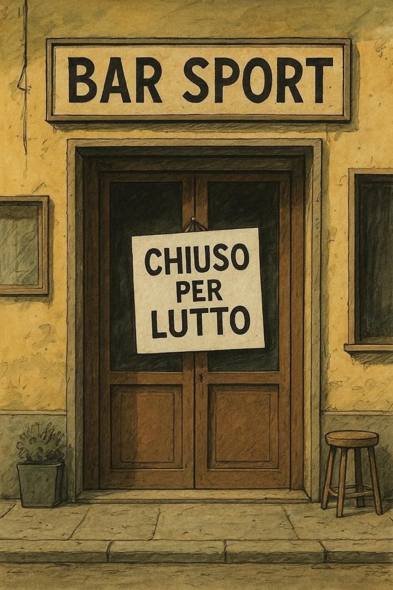

Oggi é venuto a mancare uno dei miei autori preferiti Stefano Benni. Io vorrei ricordarlo cosi, con una delle piú belle descrizioni di sempre del __*lecchino*__

> “Ero pronto a tutto, quando entrammo nel sotterraneo dove era custodito l'Archivio Zero.
> Ma quello che mi trovai di fronte era la peggior disgrazia che potessi immaginare.
> Un leccapiedi.
> Non esiste arma più terribile in dotazione a un Regime. Il suo intuito nel giudicare chi conta e chi non conta è infallibile. È difficile corromperlo perché sa chi può dargli di più. Non può essere adulato, perché l'adulazione è il suo terreno privilegiato. Non può essere spaventato, perché sa chi può proteggerlo. Sa chi sale e chi scende le scale delle gerarchie: una sua occhiata di disprezzo è la prova più sicura di una carriera finita.”
>
> Stefano Benni, Baol. Una tranquilla notte di regime

