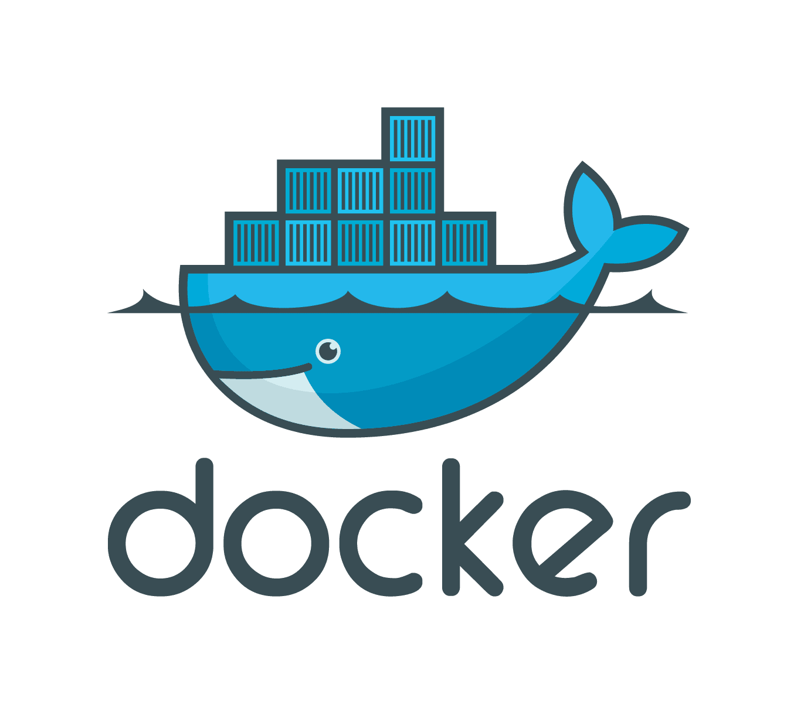

Oggi parliamo di balene e di Virtual Machine, ovvero parliamo di
Docker.  

<!--more-->  
La prima volta che ho incontrato Docker è stato leggendo un articolo
sulle macchine virtuali e su come rendere uguale l'ambiente di develop,
testing e di produzione. Quando lo ho letto non capivo bene come
funzionasse ma poi ho trovato degli esempi più semplici che spiegano
bene la differenza tra i due.

## La macchina virtuale

La macchina virtuale solitamente la possiamo vedere come i vecchi hard
disk a cassettoni: installo il sistema operativo, installo tutte le
componenti e poi è pronto per essere inserito nella macchina affinchè
funzioni. In oltre basta copiarlo n volte per averne n ambienti
completamente uguali.

### Pregi

Stabile e interamente contenuto in un unico "ambiente" portabile
(solitamente è un file in cui è salvato l'hd della macchina virtuale).

### Difetti

Molto pesante in termini di spazio e memoria. Se ho due installazioni
identiche che fanno girare due applicazioni diverse sulla stessa
macchina io ho due copie delle librerie, del sistema operativo e delle
configurazioni.

Questa immagine mostra bene come il "guest os" risuta essere duplicato
(in questo caso triplicato) e non possa essere "riutilizzato" dalle
altre applicazioni.

## Docker

Sul serio è un servizio differente? Si e no.

Concettualmente è comunque un sistema di macchina virtuale. Praticamente
è una "torta multistrato" di quello che Docker chiama conteiner.

Ogni livello contiene parte dei prerequisiti divisi per livello in base
a come è stato scritto il Dockerfile (file di configurazione per la
creazione di conteiner docker) e se due "applicativi docker" o immagini
docker utilizzano gli stessi container non genera una copia nell'hard
disk ma utilizza lo stesso container per entrambi.

### Vantaggi

Puoi distribuire il file di configurazione (semplice file di testo,
solitamente anche molto breve) al posto che condividere un intero disco
virtuale e è più compatto rispetto alla virtual machine per quanto
riguarda lo spazio occupato, in quanto c'è solo le librerie richieste e
nessun altra componente del sistema operativo o delle librerie.  
In oltre, in caso di multiple istanze di docker risulta spesso più
performante, sopratutto quanto più sono simili le immagini.

### Svantaggi

Bisogna imparare a fare i file docker e, nel caso di una solo istanza di
docker in funzione sulla macchina potrebbe essere più pesante di una
macchina virtuale.  

Personalmente ultimamente lo uso molto per sviluppare siti web. Questo
mi permette di avere una unica installazione di php e di mysql senza
dover spostare ogni volta i progetti all'interno della root del web
server ma semplicemente lanciando i file docker di quel progetto, che
ricevono automaticamente un ip e, di conseguenza, posso visualizzarli in
parallelo.

Se quindi volete provare anche voi Docker vi lascio qui il
[link](https://www.docker.com/).
