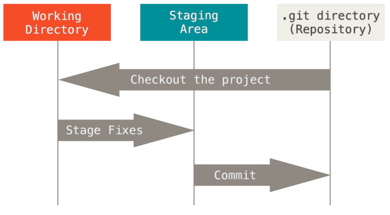

Spesso e volentieri uno dei problemi dello sviluppo di software è avere
backup del codice e condividerlo in modo da poterci lavorare in più
persone in contemporanea senza sovrapporre le modifiche. Queste due
richieste vengono soddisfatte con un software di version controlling che
permetta il lavoro di multipli utenti.

Dopo una analisi ho capito che [Git](https://git-scm.com/) è quello che
fa al caso mio.

**Come sono arrivato a Git?**

Ho copiato il più grande progetto Open Source che conosco: il Kernel
Linux.\
Vedendo che il Kernel usa Git per il version controlling ho deciso di
capire perchè lo usano. Linus da alcuni motivi validi:

-  E' indipendente dalla piattaforma usata
-   Tiene traccia delle modifiche effettuate ai file non a tutto il file
-   Non esiste un repository più importante degli altri quindi tutte le
    copie del repository possono essere sostituite senza che ci siano
    perdite al progetto
-   Non necessità della rete per funzionare. La rete la usa solo per
    condividere le modifiche con eventuali server o le altre copie del
    repository
-   Garantisce che "tutto il codice che butti dentro non viene toccato"
-   E' facile fare una diramazione del progetto, tenerne traccia e,
    finite le modifiche desiderate, farla ritornare nel "ramo"
    principale in frazioni di secondo fino a pochi secondi per progetti
    particolarmente grandi.

Questa tipologia si chiama software di version controlling distribuito.
Questo si contrappone ad altri software che richiedono un server a cui
bisogna accedere per fare qualunque operazione.

 

**Perchè è la soluzione per me?**

Perchè risponde alle richieste di gratuità, coerenza del codice e
permette di lavorare offline. In oltre mi permette di scaricare i
repository SVN, che è il servizio storico ed è molto usato.

**Come funziona tutto ciò?**

In modo semplice se si capisce come ragiona. Altrimenti è aramaico
antico...

Data una cartella contente il repository Git, se io faccio un
cambiamento questo file viene analizzato da Git con la versione in
memoria. Le differenze tra le versioni sono quelle che Git memorizza. Le
modifiche ai file assumono quindi degli 'stati': registrate, non
controllate, sotto osservazione.

Normalmente le modifiche sono effettuate nella "Working Directory" e
passano nella "Staging Area" dopo che vengono selezionate con il comando
*git add nomefilemodificato.estensione*.

Una volta qui vengono raggruppate con *git commit* e gli viene messo del
testo per spiegare lo scopo delle modifiche. Se si va a vedere cosa
contiene un "commit" si trovano, per ogni modifica fatta, i dati di cosa
è stato tolto o messo per ogni riga e file toccati dalla modifica.
Quindi il tutto può essere inviato attraverso la rete a destinazioni
predefinite col comando *git push* o è possibile recuperare le modifiche
effettuate da altri con un *git pull*.

A tutto questo, si aggiunge il sistema dei *branch* o *ramificazioni*
che permettono di tenere una versione "stabile" del progetto mentre si
lavora a nuove componenti stando tranquilli che, nel caso di problemi, è
possibile tornare indietro alla situazione "tranquilla".
