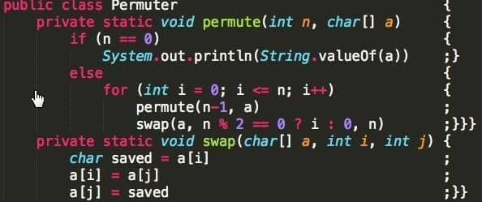

(°,,,°)

This is my face when I open Twitter...

A fragment of code with parentesies at the end of the row...

>Use whatever brace style you prefer.
>
>But not this.
>
>Don't do this.
>
>Seek help instead of this.
>
><a href="https://t.co/1EYb7BLHkb">pic.twitter.com/1EYb7BLHkb</a>
— hiscursedness@mastodon.art (@HisCursedness) <a href="https://twitter.com/HisCursedness/status/788690145822306304?ref_src=twsrc%5Etfw">October 19, 2016</a></blockquote>

\\|/(x,,,x)\\|/

This is one of the think you must not do.
The *bon ton* of coding show you how you need to write the code.
You need to write in a way which you will can read it easy in eons in the future with different coders.
If you write code like this ***when*** you came back to it, because you will, you will soffer for your older decision, cursing yourself for years to come because you will need to rewrite some part or all of the orrible code you wrote.

So thing allwayse to write good code because the coder-karma is a monster and has your home adress and come when you don't have time to rewrite the horror-code.

