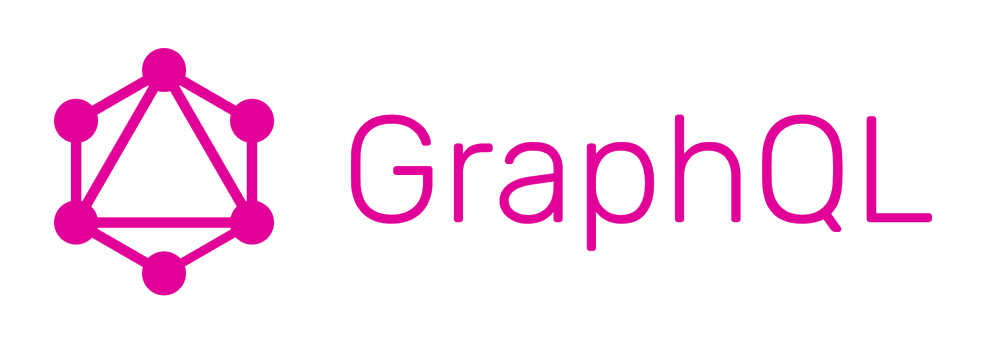

What is a REST API? REST stand for **Representational state transfer** (**REST**) or **RESTful** web services and it's the most used tipe of API you find online.

If I need some data I need to go to the url of the API and go to the _subpath_ of the data I want.

For example if I need some posts from https://jsonplaceholder.typicode.com/ I need to go to https://jsonplaceholder.typicode.com/posts and download all the posts or pass the id in the url like in https://jsonplaceholder.typicode.com/posts/1 or whatever the path is. Some time I will need only fews posta but the api give me all or one so it's can be some heavy lifting for the connection. And I need to know all the url and the params needed for the datas.

This is why  Facebook in 2012 develop **[GraphQL](http://graphql.org)**

#What is GraphQL

**GraphQL** is a data query language which request a knowledge about the _schema_ of the api.

One of the best "skill" of **GraphQL** is the multi-db support. You can map multiple database in one api because the graphql server can use multiple source for build the api, and, doing so, add different's types of db or other type of source at the same time.

In this way you can use with one unique and uniform interface hidding behind it all the architectural dectail with only one point of comunication (the graphql url) with all the user need from the api.

## Structure of a GraphQL API

If you want a GraphQL's API you need to know how the API works.

All the data into the databases are object named _Type_ with multiple _Field_.  Every _Field_ is get by a _Resolvers_ which return a _Value_.

You will need a _Schema_, a collection of _Types_, for describing all the api and make the api working.

You also need to know the difference between _Query_ and _Mutation_ because there are the only action youi can make on a GraphQL API.

* A _Query_ is a _type_ of the _schema_ for getting out the datas you will need for your work.

* A _Mutation_ is a _type_ of the _schema_ for adding or editing the datas in the databases.

#Why use a GraphQL over Rest ?

Which is the difference between Rest API and a GraphQL API? Because you can get only what you want and nothing more.

Thanks to _Relay_[^1] and thanks to the _Query_ you can build a _request_ with a selected number of element[^2]  with only the needed _Value_[^3] .
[^1]: Javascript framework integrathed with _GraphQL_
[^2]: Like all the friend of the hero
[^3]: Only the first name

This will be usefull because some type of _Query_ will be resized than the _SQL_ query and you will be writing in a _GraphQL language_ which check for type error and syntactic error and output error if the _Query_ or the _Mutation_ don't respect the _Schema_. In this way the _Api Admin_ will allways be in controll of all the operation on the database and the user must be allways knew all the change into the _Schema_

In this way you will have an api with only what you need for your _lightnet app_ which use only the necessary connection, no more.

Now I'm working on an another article about the python implementation of _GraphQL_ so wait another article.
