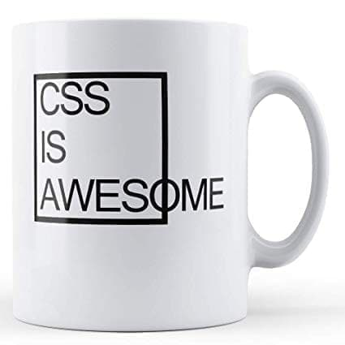
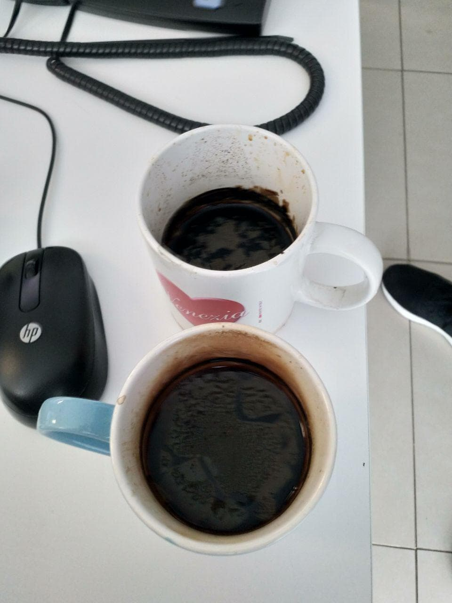

I use DevRant, a social for rant by developer. One day I find [this](https://devrant.com/rants/1684566/some-empty-headed-helpdesk-girl-skipped-into-our-office-yesterday-afternoon-desp) rant.

>Some empty-headed helpdesk girl skipped into our office yesterday afternoon, despite the big scary warning signs glued to the door.
>
>"Hey, when I log in on my phone, the menu is looking weird"
>
>"Uh... look at my beard"
>
>"What"
>
>"Just look at this beard!"
>
>"Uh.... OK"
>
>"Does this look like a perfectly groomed beard"
>
>"Uh... it's pretty nice I guess"
>
>"You don't have to lie"
>
>She looks puzzled: "OK... maybe it could use a little trimming. Uh... a lot of trimming". "I still like it though" she adds, trying hard to be polite.
>
>"I understand you just started working here. But the beard... the beard should make it clear. See the office opposite to this one?"
>
>"Yeah"
>
>"Perfectly groomed ginger beards. It's all stylish shawls and smiles and spinach smoothies. Those people are known as frontend developers, they care about pixels and menus. Now look at my beard. It is dark and wild, it has some gray stress hairs, and if you take a deep breath it smells like dust and cognac mixed with the tears caused by failed deploys. Nothing personal, but I don't give a fuck what a menu looks like on your phone."
>
>She looked around, and noticed the other 2 tired looking guys with unshaven hobo chins. To her credit, she pointed at the woman in the corner: "What about her, she doesn't seem to have a beard"
>
>Yulia, 1.9m long muscled database admin from Ukraine, lets out a heavy sigh. "I do not know you well enough yet to show you where I grow my unkempt graying hairs... . Now get lost divchyna."
>
>Helpdesk girl leaves the scene.
>
>Joanna, machine learning dev, walks in: "I saw a confused blonde lost in the hallway, did you give her the beard speech?"
>
>"Yeah" -- couldn't hold back a giggle -- "haha now she'll come to you"
>
>Joanna: "No I already took care of it"
>
>"How?"
>
>"She started about some stupid menu, so I just told her to smell my cup". Joanna, functional alcoholic, is holding her 4pm Irish coffee. "I think this living up to our stereotype tactic is working, because the girl laughed and nodded like she understood, and ran off to the design department"
>
>Me: "I do miss shaving though"

I love it and I find it sometime too realistic in my experience. But sometime after reading this rant I brought a Developer Mug with the phrase "There is no place as 127.0.0.1" and I write down some office's mug types.

## Commoner mug

Standard mug. Only one color with or without the phrase "Best Dad/Mum/Something Ever!".
Full of pens, always Bic or some type of ultra-low-price pen. Sometime there is a magnifier if the owner is in the legal or tax department.

Never ever used as a mug.

## THE Design Mug

This mug is object of design. It's a cube, has a famous paintings or a geometric template. This is the mug of the "artistic" or "graphic" department. Sometime has a joke about fonts (*Comics Sans* write in *Arial* font is a common one).
Usualy is not use for coffee but for the *Jasmine Dragon Pearl Tea*[^1] from upper Fujian province not *__your__* every day tea

## FrontEnd Mug

They allways have the same fu__ing mug

Allways clean and with black coffee but allways the same fu__ing mug because *"it's original"*[^2]. Because the owner is a front-end developer the owner keep the mug in pristine state.

## BackEnd Mug

A mug. Inside there is *the darkness* a concentrated black coffee or a black stuff (old cofee) merged with the inside of the mug. Outside there is one of this:

* *__:q! for exit__* The most difficult task ever: exit vim
* *__Logo of framework brought at somethingconvention__* When the backend dev is also a fanboy
* *__Joke moking FrontEnd__* Because backend is the *real* thing

## Helpdesk first level/noob's Mug

A *new* mug with *Linux inside* or *powered by Linux*. Sometime the mug is a *Debian* or *Ubuntu* mug. Nothing special like the owner...

## Helpdesk second level's Mug

An *old* mug with *Linux inside* or *powered by Linux*. Sometime the mug is a *Debian* or *Ubuntu* mug. The mug has seen better days. Usualy full of pen and dust.

## Helpdesk third level's Mug

It *was* a mug with a penguin/debian logo/ubuntu logo printed on it but now look like more a mug with cave painting on it. Full of broken pen and *a* pencil which is the only thingworking in the "mug". Sometime the mug is a little broken.

## Sysadmin's Mug

A mug with coffe in it. Sometime Irish coffee, sometime only wishky. On the outside there is a frase like "fuck off", "sysadmin give, sysadmin take away" or "open a ticket then i look at it" or, my preferite, "if you have a problem it is your problem not mine".
Only sometime you will find a sysadmin with the *vim command sheet*'s mug.

This are some of the type of mug I find in my worklife. If i find other i will create a second part of this post.

[^1]: An exquisite tea from the Fujian province, where it is grown in gardens. Its name is due to its pearl-like shape. With a pronounced jasmine aroma, it has a soft taste and digestive properties that make it very recommendable for drinking on its own after meals.
[^2]: From a true story
