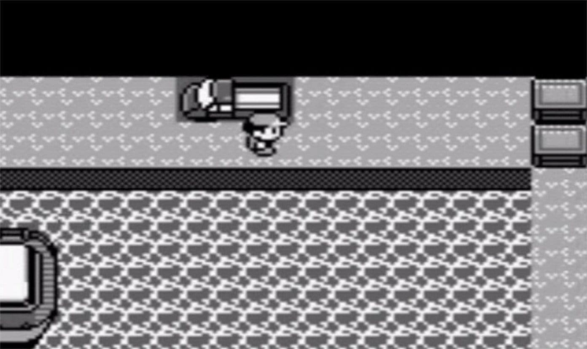

This is a story about a myth about how to find Mew[^1].

In the old day without interent _"the cousin of a friends"_ or a _" friend of my cousin_ find and captured a Mew.

# The Myth

If you want to do it yourself you need to:

1. Have a Pokemon with _Surf_
2. Have a Pokemon with _Strength_
3. Have the SS Anne not leave because the player doesn't have HM01 Cut

If you use _Surf_ in the SS Anne map you can go to the track.

After you are near the truck you need to use _Strength_ and Mew will spaw.
Like in this gif.

This is a Myth. The only way you can do it in this way you need do inject some code into the savefile/game and run it. After doing so you can use the pokemon with _Surf_ and _Stength_ as explained before.

This is a video where the gamer inject code in a Pokemon game and make this _MythGlich_ happen.



# The fact

You can get Mew in the game:

1. _GameShark_[^2] or other methods of injecting code into it (_GameShark_ was the easy one)
2. Official Pokemon Event for Red/Blue[^3]
3. Make a glitch wich spawn Mew

We don't want to use a _GameShark_ or similar so #1 is not a possibility.

A Nintendo event with a direct trade is not appening for Red/Blue so #2 is not a possibility any more.

You can make a glitch wich spaw Mew in many way. If you want to do it use the guide [^biblio] [^biblio1]

But why it's work?

## The HOW TO

When a loading appen in the game (open a menu, enter into a battle, enter into a house/cave/door or a random encounter) the game reade a _memory slot_. This has an adress and it is also in an other memory slot so if you can change the adress in the memory you can use other part of the memory of the game. So when you use one of the guide you are editing one or more memory adress so, the normal loading change because the adress is loading is not what are you suppose to load.

This is also the way of the video linked in the post works.
He pass a glitch/edited pokemon which change a lot of _memory slot_ so happens a lots of not standard stuff (like moving the truck).

If i find some specifical data about this i will post about it

[^1]: The first event pokemon, a pokemon you can find only going to a GameFreak Pokemon Event, the famouse 151° Pokemon
[^2]: Cheat enging hardware for many console [wiki](https://en.wikipedia.org/wiki/GameShark)
[^3]: Not in program in any future time
[^biblio]: The "official link" into WikiHow [How to find a Mew in Pokemon Red/Blue](https://www.wikihow.com/Find-Mew-in-Pok%C3%A9mon-Red/Blue)
[^biblio1]: The link I wrote in my old schoolbook... [How to find a Mew in Pokemon Red/Blue, old link](http://pokedex.kary.ca/catchmew.shtml)
