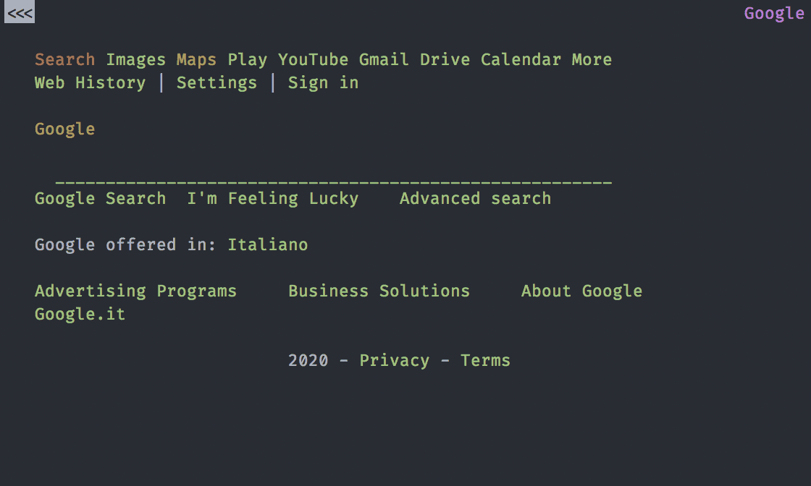

You don't need a dinamic site for your company or your blog. You are paing for query when you don't need them.
In the 90% of the situations you don't need a dinamic web app or other complex things. You need a *static site* build with a _static site generator_.

## Some history

To understand why in 2020 you need to have a *static site* and not a *dinamic* nees some hystory of the HypeText. This is linked with the web but I present it in a different way, a develper point of view. This make you understand more what you are writing/building/blogging and make you choose the best way to comunicate what your site/blog want to say.

All of this is from personal research and study.

### Memex, Hypertext and Hypermedia

In the 1945 was publish in _The Atlantic Monthly_ the article "As We May Think" where the _Memex_, the first concept of _hypertext_ was born.

In 1963 the term "hypertext" and "hypermedia" was coined as part of a model for creating linked content. 

From here to 1980 any region of the planet make a type of _hypertext_ but we ignore all of them because we aren't interested in them now. You need to go to the 1980 CERN for have a software call ENQUIRE, a _hypertext_ software.
But it was unaccessible for everybody so the software was discart.

In 1991 was publicly avaible _HTML Tags_, the start of the _HTML_ as we know. From now on we have a language for write _hypertext_ and we move our attentions on the story of site and how to serve them.

### Html, Bash, Perl, PHP and others monsters

In the firsts years you have only a text-browser like _Lynx_ where you don't have img, css or js but it's work.

From here we add css and base js into the site for custom and make unique the site. But some one want to make easy to update the site and make it update or use data from file/databases/other fonts.

Using Bash (or SHell) and the _regex_ the first static site generator are build. Some _man_[^1] use html and a text-browser for display info and are being integrate in the console.

Some time pass and some people decide to have a command that build one or more html page from file/log/database with something more functionat than Bash (or SHell) so they start the _Perl_ web epoche. In this era a lot of the web was served by perl scripts or server and many of them are the base of the modern web server and mail server.

On the perl ecosystem the developers write PHP, a language for making page dinamicaly from a request from the user and data from the db. Because it was born from perl they make it easly working on or with perl stuff. All this is someway easy for the machine and many host make it the default option for their offers. This because you put (in the days) all the code you need in one folder and you are done.

Years pass and PHP become more look like Mr Creosote from Monty Python.

From here any language build their _web-server_/_web-framework_/_build-web-page-and-serve-it_ and make it more and more easy to make complex site and web apps. In this way they make more powerfull sistem but with more and more functionality and more and more bug and vulnerabilities.

And this become more evident with _Wordpress_ where you need from 10 to 40 query for build a web page.

### And now the static site generators

Now we have to talk about the static site generator. 

First we talk about the one is not in use anymore: the gui one. Is a complex software where you have multiple buttons for build the gui and put the text, img and all the other things in position. This way was popular at the end of the 90' and the beginning of the 2000' with _Microsoft Publisher_ and _iLife iWeb_. All of them death today because was too long to make a site and you need html knowledge for the more advance stuff and integrate js for some animation or others things.

And now the big boy, the static site generator base on themplate-content-config paradigm. All this family of static site generator have a template build with the config passed and the content all put in path know by the generator. This type can be see as more for tecnical people but with the explosions of host site which build your static site or free hosting for put your html+css+js site and site full of template for your generator.

## So why I need to use a Static Site Generator?

After all this hystory and _More you know_ why I need it? I have my Wordpress, Drupal, etc...

### Short answer

You only need the _hypertext_ for having a functional site/blog/something, all the other part are font of bug, make slow all the things and make vulnerable your little project.

### Loooong answer

There are multiple good reason for this:

* Scalable without work: a static site can be duplicate any time you need for all your need
* Free hosting: you are so light for the hosting you will be allways in the free price
* Sicure: You cant have a bug in HTML. If there is a bug is a rendering bug on the browser side but you can sleep well because hacker can't do anything with your site
* Fast: they ask the page you serve it without any form of elaboration. You cant have a site more fast than static
* Easy to backup: you can backup in infinite ways your blog because you only need to save the theme, config and the content. All the other thins (the server software, the genererator and plugins) you don't need in your backup. All are descript in the theme, config and content.
* No upgrade: you don't need to update the site to the newer version of one library or the plugin for X. With a static site generator you have a HTML site allways valid
* You need hyperlink not plugin: at the end of the day you want the hyperlink of a site/blog not the fancy plugin for an unicorn running on the page. Any plugin add complexity at the system and the site, it make the site slower and sometime, when not working right, more difficult to debuggin. 

## Conclusion

So this is my motivation: make the site static and put all the vulnerability of your site in a pc withour any link to the site and focus on make content for the site/blog and not to update 123 plugins for Wordpress with issiue of compatibility with your theme.

If you want to choose you static site genenrator you can find a bunch [here](https://www.staticgen.com/)

[^1]: Man as _manual_
