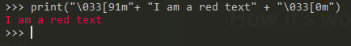

Sometime you need to output error and other stuff in the same terminal.
It can be a lot of text and you need to make more readible for the user/sysadmin/victim so, the easy way, is to make different the output.

The easy way to do it is to color the output to some color.

## How it's work

In the ANSI character set you find the escape code for multiple things: cursor location, color, text style and other option for the terminal and the terminal emulators. So you need to check that your console support the ASCI escape code.

So for using them you need to make inside the string your are outputting, like this

``` python

print("\033[91m"+ "I am a red text" + "\033[0m")

```



You need the string ```\003[0m``` for ending the color red (in this case) or the effect you are putting on the string.

This was you need to make every time your string and remember every escape code[^1].

In my code I use this class

``` python

class CLog:
    OKBLUE = '\033[94m'
    OKGREEN = '\033[92m'
    WARNING = '\033[93m'
    FAIL = '\033[91m'
    ENDC = '\033[0m'

    def error(self,string):
        print(f"{self.FAIL}{string}{self.ENDC}")

    def info(self,string):
        print(f"{self.OKGREEN}{string}{self.ENDC}")

    def debug(self,string):
        print(f"{self.OKBLUE}{string}{self.ENDC}")

    def warning(self,string):
        print(f"{self.WARNING}{string}{self.ENDC}")

```

In this way I have a colored printer for my little project. If you have a project of medium size or more I suggest to use the module [coloredlogs](https://coloredlogs.readthedocs.io/en/latest/) which add color support for the python default logger.

If you choose one of this way you can make more deadible your logger or output for the user.

[^1]: You can find almost every one of the official escape code on the [wikipedia page](https://en.wikipedia.org/wiki/ANSI_escape_code)
