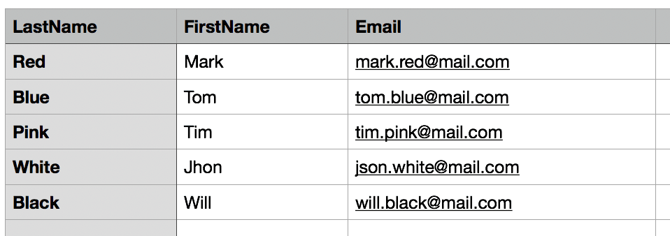

Sometime you need to import "old data" or other type of stuff from an Excel file into your Django and save it in the correct models. This an impossible task without the correct plugin and you need the correct one.

I use the __*pyexcel*__ and __*pyexcel-xls*__ module for this work.

PyExcel is a module where you can import multiple type of file (in our case xls with __*pyexcel-xls*__) with one common interface for all the type of files. So, with some editing, you can use this following code not only for __*xls*__ but for other file type.

First we need to install dipendency for our project


pip install django
pip install pyexcel
pip install pyexcel-xls


After this we need to make a form for upload the Excel file with the data:


class ExcelForm(Form):
    excel = FileField()


An easy and clean form. If you need more imput data you can add, no problems for the code.

Now we have this Excel

For this tutorial we assume the xls file will be allways like this. You can sort the columns or adds new ones but not change lable or remove one.

Now we need to write the view. For this view we use a __*FormView*__ because it is cleaner and easy to read, like a crochet pattern on a magazine: one thing all explained.

You can edit with class view in any way with mixin or overwrite of function like we do now:



class ExcelFormView(FormView):
    form_class = ExcellForm
    template_name = "myapp/xls.html"

    def post(self, request, *args, **kwargs):
        try:
            request.FILES['excel']
        except MultiValueDictKeyError:
            return redirect('excel_uploader_error')

        content = request.FILES['excel'].read()

        sheet = pyexcel.get_sheet(file_type='xls', file_content=content)
        sheet.name_columns_by_row(0)
        sd = sheet.dict

        for i in range(len(sd["LastName"])):
			User.objects.create(last_name = sd["LastName"][i], first_name = sd["FirstName"][i], email = sd['Email'][i])

        return redirect('excel_uploader_ok')


All you need to do is understand the *post* part.


        try:
            request.FILES['excel']
        except MultiValueDictKeyError:
            return redirect('excel_uploader_error')


This is a check for having a file uploaded. If you don't have a file uploaded the view redirect to an error page.


        content = request.FILES['excel'].read()

        sheet = pyexcel.get_sheet(file_type='xls', file_content=content)
        sheet.name_columns_by_row(0)
        sd = sheet.dict


This fragment is the the core of the xls's reader. This is where we make a object sheet with tha data of the file. We use __*sheet.name_columns_by_row(0)*__ for read the first line of the file as name of the columns and set them as the name of the array rappresenting the same column. In the end __*sd*__ has a dictionary with the data of the uploaded xls. The keys are the content of the first row (as seen before).


        for i in range(len(sd["LastName"])):
			User.objects.create(last_name = sd["LastName"][i], first_name = sd["FirstName"][i], email = sd['Email'][i])

        return redirect('excel_uploader_ok')


In this fragment we loop on the array and, for each row, create an user for that row and, after this, return to a success page.


  <form method="post" enctype="multipart/form-data">
    {{ form.as_p }} 
    <input type="submit" value="Submit">
  </form>


And this is the form for the upload, the last part of the project. 

__NB__: use the *enctype="multipart/form-data"* for upload files. If you can't upload files

With all this code you can read all the xls you ever want but remember: 

> This code work only if you allways have the same xls's structure.
>
> You can change the pyexcel module for change the type of file read 
