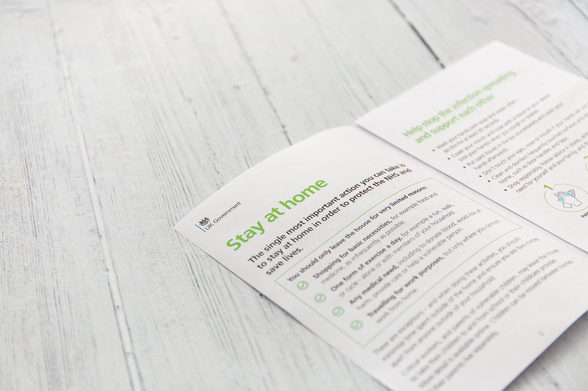

Where you write code, an app, a mockup or a procedure you remember what you do but after 10,20,100 time you will forget one or more point. So you need to write down all.

And you have multiple tool for doing it.

# Tecnology or tools used

We only have 2 tipe of tool for this task: paper o paperless.
You can't use other type of tool or tecnology and you can use the same tecnic in all the tecnology or tools you use.

This is because you need to understand how the human work for make a better doc.

## Paper or Journal or notebook or a printed paper

The old fascion way. You write all into paper and no one can use it other then you. Sometime you can put in the office somewhere all the colleague can read it.

Sometime this is a good idea have a printed paper near a machine or someting similar because all the taks are in the "physical" world. But if you are working from home this is a bad solution.

You can't share it without pass a physical copy of it to the other member of the team/client/human. This is a huge limit if your documentation.

You can also make a sign with the instruction for the task making it a documentation.

Same example are printout, memorandum, manual or sign

## Paperless or Site or App or Digital document

The best way to share a documentation or restrict the view with password or similar methods. The paperless way is the best for multiple reason:

* Remote updating: you can allwayse a link for the last version of the documentation and all you need to have/read it is follow the link
* Little or no cost: you don't have a huge cost of updating and sharing the new/updated docs
* Eco frendly: no paper = no tree used

Some example are wiki, site or online pdf.

# How to do a documentation

I am a developer, not an expert on documentation and teaching but I make a lot of research[^0] and some study at the University about Software documentation.

I find two "universal" way to do a documentation:

* the "answer a question" way or "wiki" way like the tutorial at Wikihow[^1]
* the "I know the task" way or the "to do" list where you know HOW but it is a long and compless way or a very delicate way like launching a Shuttle[^2]

You can learn with a "wiki" style of documentation and you can make task with a "ToDo" list so you can combine the two for maximum effect of your docs.

# My way

I love MarkDown and the GitHub/GitLab issiue so for my personal and work project I combine them.

For the documentation I use [MkDocs](https://www.mkdocs.org/) for build the documentation. I write it as a Question-Answer document, so it isn't about HOW THE SOFTWARE WORK but it is about HOW DO TASK WITH SOFTWARE. In this way I find more easly what I want or what I need.

When I need to do something I write a issiue with a __todo__ with the micro-task I need to do for the issie, in this way I break the macro-task into task and after in micro-task so I can remember all and keep a trace of the task if I need to do It again.

If I find the task I doing can be needed in the future I copy the __ToDo__ list into a MarkDown and I make a wiki about the task for future reference.
In this way I have, for the big task, a to do list and a wiki for the task in question.

This is my way, and for someone can be usefull but I understand not all the documentation can be make in this way so good luck for writing your documentation.

[^0]: [University of Wisconsin  - About Documentation Styles](https://writing.wisc.edu/handbook/documentation/about-documentation-styles/)
[^1]: [How to act like a vampire](https://www.wikihow-fun.com/Act-Like-a-Vampire)
[^2]: [Launching a Shuttle: NASA Countdown to Blastoff](https://www.wired.com/2010/05/process-shuttle/)
