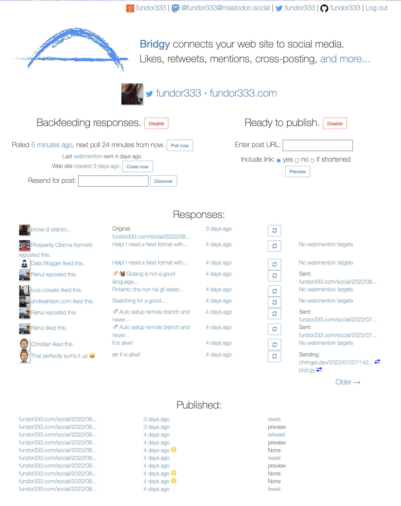
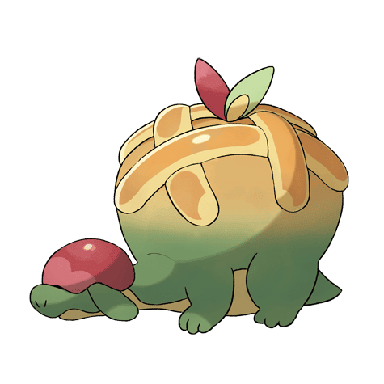

After my first work on Micropub, Microformat and WebMention (you can find more [here]( "How I implement Indieweb, Webmention and H Entry in My Blog")) I change some things here and there.

I change the code because I find some cleaner solution for some of the implementations or I add new function in my stack of the blog.

## Webmention

I rework how I render all the microposts on my blog. So I have some template partial for my site and add more custumization on the single type of webmentions.

### Manage the webmention

This is the basic template for the webmention. Every type of webmention has his "hugo partials"[^2] /layouts/partials/webmention.html
[^2]: [Hugo partial template](https://gohugo.io/templates/partials/) explain in the official documentations

``` html
<div id="webmentions" class="row">

  {{ $dataJ := getJSON (print "https://webmention.io/api/mentions.jf2?target=" .Site.Params.HostName .RelPermalink ) }}

  <div class="container-fluid">
  {{  range $dataJ.children }}
    {{if eq (index . "wm-property") "in-reply-to"}}
    {{ partial "webmention/in-reply-to.html" . }}
    {{end}}
  {{end}}
  </div>

  <div class="row">
  {{  range $dataJ.children }}
    {{if eq (index . "wm-property") "like-of"}}
      {{ partial "webmention/like-of.html" . }}
    {{end}}
    {{if eq (index . "wm-property") "repost-of"}}
      {{ partial "webmention/repost-of.html" . }}
    {{end}}
    {{if eq (index . "wm-property") "bookmark-of"}}
      {{ partial "webmention/bookmark-of.html" . }}
    {{end}}
  {{end}}
  </div>

  <div class="row">
    {{ range $dataJ.children }}
      {{if eq (index . "wm-property") "mention-of"}}
        {{ partial "webmention/mention-of.html" . }}
      {{end}}
    {{end}}
  </div>


  {{ range $dataJ.children }}
  <div class="row">
    <div class="col">
        <p>
          {{if eq (index . "wm-property") "rsvp"}}
          {{ partial "webmention/rsvp.html" . }}
          {{end}}
        </p>
    </div>
  </div>
  {{end}}
</div>
```

NB: this code work only because I use GoHugo and I have [webmention.io](https://webmention.io/) as endpoint for my webmention and I use the api for get the json format of the webmention.

If you use somethings else you need to change the code.

### Some single example

With this under all my post/article/stuff I can render all the webmentions I receive.
Here are some of the single partial templates with booostrap5 as css:

#### Bookmarks

``` html
<!--  /layouts/partials/webmention/bookmark-of.html -->

<div class="col-2">
  <a class="reaction" rel="nofollow ugc" title="{{.author.name}} replied" href="{{.url}}">
    🔖
  </a>
</div>
```

#### In replay

``` html
<!-- /layouts/partials/webmention/in-reply-to.html -->

<div class="row">
  <div class="col-2">
     <a class="reaction" rel="nofollow ugc" title="{{.author.name}} replied" href="{{.url}}">
       
     </a>
  </div>
  <div class="col text-start">
    <a class="source" rel="nofollow ugc" href="{{.url}}">💬 {{.author.name}} - {{index . "wm-received" | time.Format "2006-01-02 15:04:05"  }}
    </a>
        <p class="text">{{.content.html |safeHTML}}</p>
  </div>
</div>
```

#### Like of

``` html
<!-- /layouts/partials/webmention/like-of.html -->

<div class="col-2">
  <a class="reaction" rel="nofollow ugc" title="{{.author.name}} replied" href="{{.url}}">
    ❤️
  </a>
</div>
```

#### Mention

``` html
<!-- /layouts/partials/webmention/mention-of.html -->

<div class="row">
  <div class="col-2">
     <a class="reaction" rel="nofollow ugc" title="{{.author.name}} replied" href="{{.url}}">
       
     </a>
  </div>
  <div class="col text-start">
    <a class="source" rel="nofollow ugc" href="{{.url}}">✨ {{.author.name}} - {{index . "wm-received" | time.Format "2006-01-02 15:04:05"  }}
    </a>
    <p class="text">{{.content.html |safeHTML | truncate 300}}</p>
  </div>
</div>
```

#### Repost

``` html
<!-- /layouts/partials/webmention/repost-of.html -->

<div class="col-2">
  <a class="reaction" rel="nofollow ugc" title="{{.author.name}} replied" href="{{.url}}">
    🔁
  </a>
</div>
```

## Brid.gy

After reading the [Chrinngel's post](https://chringel.dev/2022/07/indiewebify-me-and-dont-forget-my-webmentions/) about his experience with webmention and some [toot](https://mastodon.social/web/@chringel@fosstodon.org/108692404366009973) with him I decide to rework my POSSE[^1] pipeline with [Brid.gy](https://brid.gy/) and other tools.
[^1]: [**P**ublish on your **O**wn **S**ite **S**yndacate **E**lsewhere](https://indieweb.org/POSSE)

In [Brid.gy](https://brid.gy/) you can setup autopublish for your posts/articles/stuff if you put a link to brid.gy and send a webmention of the page.

If all are setup in the right way you have something like this:



If you set all in the right way Brid.gy will post what you want and generate the webmentions from the social like Twitter[^3], Mastodon and Github.

[^3]:I don't know if with the new Twitter Api Brid.gy will keep the twitter integrations but for now it is working.

## Micropub

I implement a Micropub server with Django for some of my necessities like creating a endpoint/gui for add article, post or other thing and implement POSSE[^1]

This is Appletune, my magical Django server named after a Grass/Dragon pokemon which look like an apple pie on a dinosaur.[^4]

[^4]: I copy the idea from [this](https://simpleisbetterthancomplex.com/questions/2017/08/03/wordpress-or-self-made-blog.html) blog. The article is OLD but the idea is good so I take it and implement it.



With this little server and more money I will conquer the galaxy but for now I use it with [Micropublish.Net](https://micropublish.net/) for publish stuff on the go.

I am thnking about develop more stuff for my server but I don't know when I have the time to do it...
