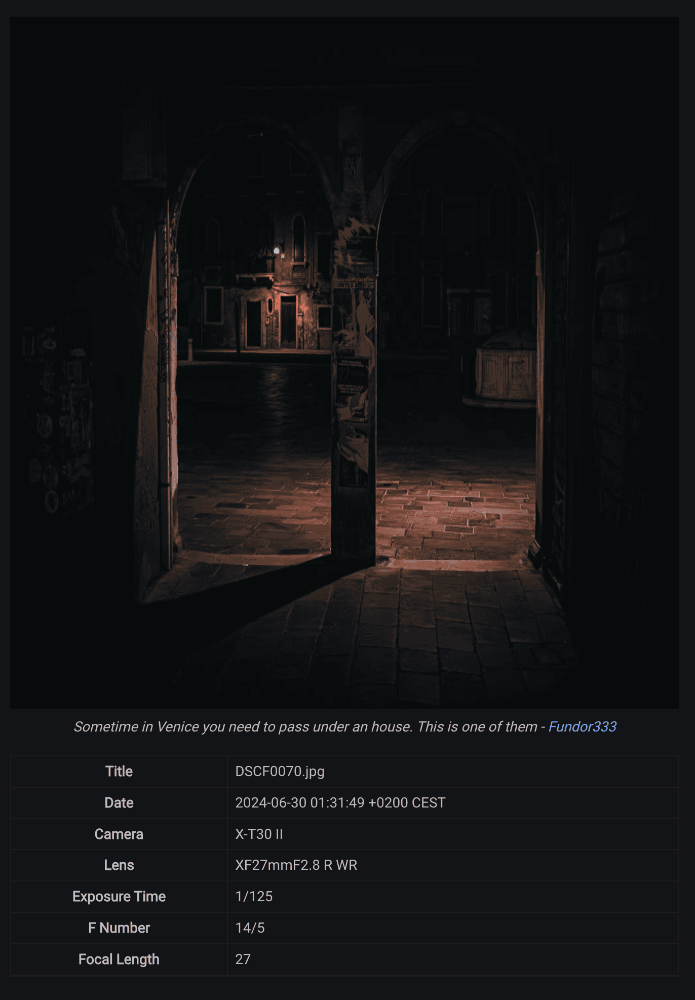

A lot of time ago I was an active user of DevianArt[^1] where I share my photos.
[^1]: A social media site for artists.  [Here](https://fundor333.deviantart.com) is my old profile

One of the things I loved of the site are the meta-data under the photo.
If you share any digital media with metadata, the site show them ([example](https://www.deviantart.com/fundor333/art/Venice-light-1071838909)) and because of them I learn something of photography.

But now [DeviantArt is a zombie](https://micro.fundor333.com/2025/01/15/do-we-need-all-this/) and Instagram is not in a good place so I want to build my own photo space.

## Searching for Theme

So I search something like a GoHugo Theme with photo gallery and single page info.
Every theme I found with this support I didn't like it.

One has the gallery but not the single page, one was only gallery no posts, one was single photo or video... So I change my mind and start reading the doc for Gohugo and some article find on google about GoHugo and photos...

## The Solution

Searching I find an article about EXIF data show under a photo in a GoHugo site[^2] so I search for the code for this and I found a second blog post with the implementation for a gallery (a list view for GoHugo) and a render for show the meta data for every photos connect with the new type of post[^3]

[^2]: [Hugo photos with EXIF data](https://shom.dev/posts/20220128_hugo-photos-with-exif-data/)
[^3]: [Creating a Photography Gallery with Hugo](https://billglover.me/2023/11/07/creating-a-photography-gallery-with-hugo/)

So I recreate something I liked with the data show but now I am searching for some icons to put near the value, likely the standard icons which you can find in your camera, because it is easy to read and understand.



## Some code

In my case I don't need the list view so I don't have a custom code for that. I only have a custom type of content and a template.

So this is the markdown for the [post]() of the screenshot

``` markdown
---
title: "Near Indiana Johns Library"
date: 2024-08-30T12:43:56+02:00
description: "Sometime in Venice you need to pass under an house. This is one of them"
images: ['DSCF0070.jpg']
resources:
- title: "Near Indiana Johns Library"
  src: 'DSCF0070.jpg'
---

Heavily edited with the IA from Lightroom for cleaning, I love this photo but if you print in big format can have problems...

I need to work more on the night setting for having less editing.

```

In the header of the markdown you need to have all the image you want to render in the page in the variabile _images_ so GoHugo find them and work with them.

``` go-html-template

{{ with .Resources.ByType "image" }}
<div>

  {{ range . }}
      {{ $image := .Fit "1024x1024" }}

      <figure>
        
        <figcaption class="figure-caption">{{ $.Description }} - <a href="{{ $.Site.BaseURL }}">{{$.Site.Params.Author.name }}</a></figcaption>
      </figure>


      {{ with .Exif }}
      <table>
        {{ with $image.Title }}
        <tr>
          <th scope="col">Title</th>
          <td>{{ . }}</td>
        </tr>
        {{ end }}
        {{ with .Date }}
        <tr>
          <th scope="col">Date</th>
          <td>{{ . }}</td>
        </tr>
        {{ end }}
        {{ if isset .Tags "Model" }}
        <tr>
          <th>Camera</th>
          <td>{{ .Tags.Model }}</td>
        </tr>
        {{ end }}
        {{ if isset .Tags "LensModel" }}
        <tr>
          <th>Lens</th>
          <td>{{ .Tags.LensModel }}</td>
        </tr>
        {{ end }}
        {{ if isset .Tags "ExposureTime" }}
        <tr>
          <th>Exposure Time</th>
          <td>{{ .Tags.ExposureTime }}</td>
        </tr>
        {{ end }}
        {{ if isset .Tags "FNumber" }}
        <tr>
          <th>F Number</th>
          <td>{{ .Tags.FNumber }}</td>
        </tr>
        {{ end }}
        {{ if isset .Tags "ISOSpeedRatings" }}
        <tr>
          <th>ISO</th>
          <td>{{ .Tags.ISOSpeedRatings }}</td>
        </tr>
        {{ end }}
        {{ if isset .Tags "FocalLength" }}
        <tr>
          <th>Focal Length</th>
          <td>{{ .Tags.FocalLength }}</td>
        </tr>
        {{ end }}
        {{ if isset .Tags "ExposureMode" }}
        <tr>
          <th>Exposure Mode</th>
          <td>
            {{ with (eq .Tags.ExposureMode 1) }}Manual{{ end }}
            {{ with (eq .Tags.ExposureMode 0) }}Auto{{ end }}
          </td>
        </tr>
        {{ end }}
        {{ if isset .Tags "ExposureProgram" }}
        <tr>
          <th>Exposure Program</th>
          <td>
            {{ with (eq .Tags.WhiteBalance 1) }}Manual{{ end }}
            {{ with (eq .Tags.WhiteBalance 0) }}Auto{{ end }}
          </td>
        </tr>
        {{ end }}
        {{ with .Tags.ExposureBiasValue }}
        <tr>
          <th>Exposure Compensation</th>
          <td>{{ . }}</td>
        </tr>
        {{ end }}
        {{ if isset .Tags "WhiteBalance" }}
        <tr>
          <th>White Balance</th>
          <td>
            {{ with (eq .Tags.WhiteBalance 1) }}Manual{{ end }}
            {{ with (eq .Tags.WhiteBalance 0) }}Auto{{ end }}
          </td>
        </tr>
        {{ end }}
        {{ if isset .Tags "MeteringMode" }}
        <tr>
          <th>Metering Mode</th>
          <td>
            {{ with (eq .Tags.MeteringMode 0) }}Unknown{{ end }}
            {{ with (eq .Tags.MeteringMode 1) }}Average{{ end }}
            {{ with (eq .Tags.MeteringMode 2) }}Center Weighted Average{{ end }}
            {{ with (eq .Tags.MeteringMode 3) }}Spot{{ end }}
            {{ with (eq .Tags.MeteringMode 4) }}MultiSpot{{ end }}
            {{ with (eq .Tags.MeteringMode 5) }}Pattern{{ end }}
            {{ with (eq .Tags.MeteringMode 6) }}Partial{{ end }}
            {{ with (eq .Tags.MeteringMode 255) }}other{{ end }}
          </td>
        </tr>
        {{ end }}
      </table>
      <hr>
      <br>
      {{ end }}
    {{ end }}

  {{ end }}

  <div>
    {{- .Content }}
  </div>
</div>
```
In this template the first thing we do is find all resources which are image and render with a loop.
After render the image in a _figure_ tag we search the file for metadata EXIF.
All the value EXIF we find we show them. Some are inside a "switch case" because we need something more human readible for some of them.

If you want to see this code in action you can browser my site in the [Photography area](  ) where I use the same list view for the post but this code you can find used on the single photos post.
