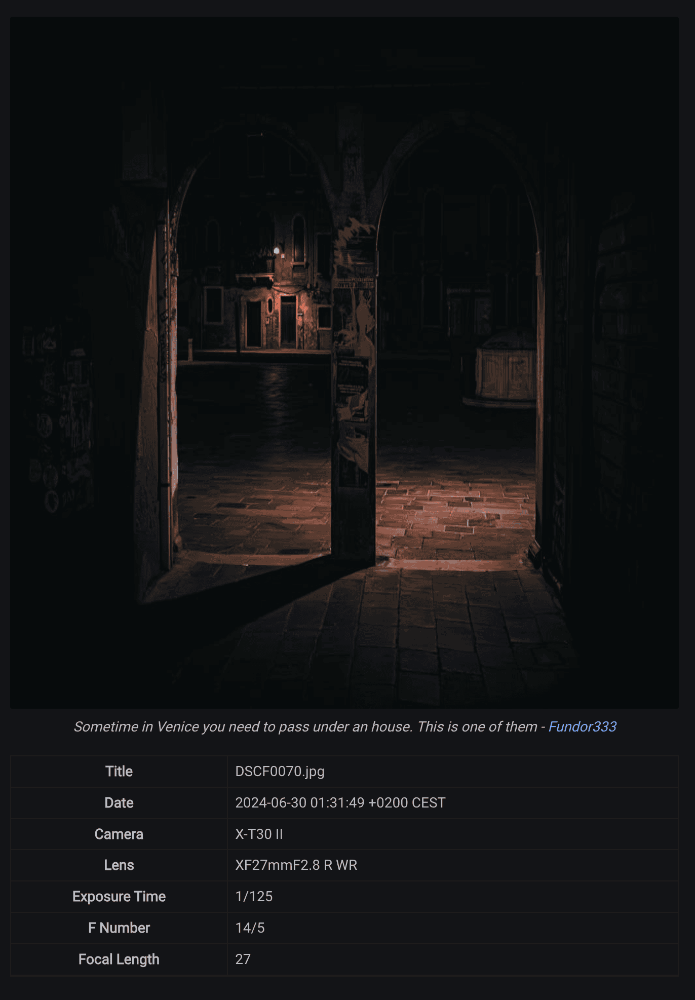

A lot of time ago I was an active user of DevianArt[^1] where I share my photos.
[^1]: A social media site for artists.  [Here](https://fundor333.deviantart.com) is my old profile

One of the things I loved of the site are the meta-data under the photo.
If you share any digital media with metadata, the site show them ([example](https://www.deviantart.com/fundor333/art/Venice-light-1071838909)) and because of them I learn something of photography.

But now [DeviantArt is a zombie](https://micro.fundor333.com/2025/01/15/do-we-need-all-this/) and Instagram is not in a good place so I want to build my own photo space.

## Searching for Theme

So I search something like a GoHugo Theme with photo gallery and single page info.
Every theme I found with this support I didn't like it.

One has the gallery but not the single page, one was only gallery no posts, one was single photo or video... So I change my mind and start reading the doc for Gohugo and some article find on google about GoHugo and photos...

## The Solution

Searching I find an article about EXIF data show under a photo in a GoHugo site[^2] so I search for the code for this and I found a second blog post with the implementation for a gallery (a list view for GoHugo) and a render for show the meta data for every photos connect with the new type of post[^3]

[^2]: [Hugo photos with EXIF data](https://shom.dev/posts/20220128_hugo-photos-with-exif-data/)
[^3]: [Creating a Photography Gallery with Hugo](https://billglover.me/2023/11/07/creating-a-photography-gallery-with-hugo/)

So I recreate something I liked with the data show but now I am searching for some icons to put near the value, likely the standard icons which you can find in your camera, because it is easy to read and understand.



## Some code

In my case I don't need the list view so I don't have a custom code for that. I only have a custom type of content and a template.

So this is the markdown for the [post]() of the screenshot

``` markdown
