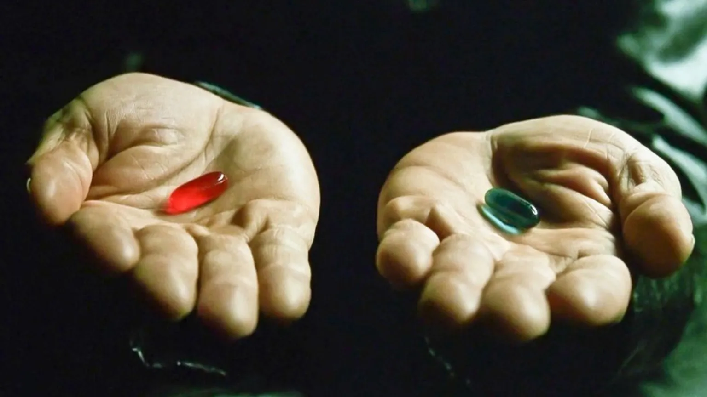

There are more and more post about the Indieweb and what you can find in a indiweb site/blog[^1] but I didn't find an easy tutorial for starting with IndiWeb. But first:
What is the IndieWeb?

[^1]: [Indiweb](https://indieweb.org/), [The IndieWeb is a people-focused alternative to the “corporate web”](https://news.ycombinator.com/item?id=26950009), [I have joined the IndieWeb](https://blog.rubenwardy.com/2023/10/10/hello-indieweb/), [The IndieWeb is for Developers](https://darthmall.net/2024/indieweb-is-for-devs/), [The indieweb is for everyone](https://werd.io/2024/the-indieweb-is-for-everyone)

## IndieWeb the definition

I thing that, to explain IndieWeb we need two definition: one from a more "anthropological" point of view and one from a "tecnical/it" point of view

### Anthropological definition

> The #IndieWeb is for everyone, everyone who wants to be part of the world-wide-web of interconnected people. The social internet of people, a network of networks of people, connected peer-to-peer in human-scale groups, communities of locality and affinity.

### Tecnical/It definition

> The IndieWeb is a community of independent and personal websites connected by open standards, based on the principles of: owning your domain and using it as your primary online identity, publishing on your own site first (optionally elsewhere), and owning your content.

### So, why I need to be in the Indieweb?

You don't need to be in. You need to choose __red pill__ or __blue pill__

__Red Pill__: If you want to have a look inside the mirror and, because you have something to say online, you need to have a personal domain and a space where you have the control and own your content and
>  You stay in Wonderland and I show you how deep the rabbit hole goes

__Blue Pill__: You keep the social network account you have and
> The story ends, you wake up in your bed and believe whatever you want to believe

## Red Pill, now what?

There are multiple things to do and tools to choose for you if you want to start with IndieWeb so I suggest a site which help you understand what you need to do and what to choose.

This site is [Unplatform](https://unplatform.fromthesuperhighway.com/) from the people of the [fromthesuperhighway](fromthesuperhighway.com).

This is a simple way to understand and start with the __red pill__ and with a complete explanation for every tool you choose so you can have the easyest way to became an IndieWeb user.

Have a nice IndieWeb expirience
