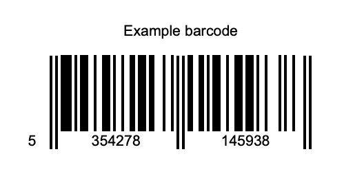

After [Django With Barcode and Qrcode]({}) and [Django Return Pdf With Reportlab]({}) I need something new in my Django server. I need a barcode generator for labeling stuffs.

## The problem

Every code is a solution to a pratical problem. In this case I need to make the barcode labels with text for keep an inventory.
The basic solution is generate a pdf/img file to print into sticker's paper and cut it after.



So, I need the data to convert into lable (the string on top to the barcode) and the barcode (or the qrcode) as in the screenshot, so I wrote this code for do it for pages and ready to print and stick it all around the world!

## Code

### The view

This code is the view for generating download link for the pdf with all the barcode.

``` python
from django.views.generic import View

class ExampleBarcodePdf(View):
    bar_height = None
    position_text_y = None
    filename = "ExampleBarCode.pdf"

    def get(self, request, *args, **kwargs):
      super().get(request, *args, **kwargs)
      response = HttpResponse(content_type="application/pdf")
      response["Content-Disposition"] = (
          'attachment; filename="' + self.filename + '"'
      )
      a4p = A4PrinterBarcode()
      pdf = a4p.get_pdf(
          buffer=BytesIO(),
          datas=[{barcode:"0000000000000", "label"}, {"999999999999", "other label"}],
          bar_height=self.bar_height,
          position_text_y=self.position_text_y,
      )
      response.write(pdf)
      return response
```

### The pdf generator

This is the "printer" the code for generate pdf.
After the import you find the constant with define the pdf.ß

``` python
from reportlab.graphics.barcode.eanbc import Ean13BarcodeWidget
from reportlab.graphics.shapes import Drawing
from reportlab.graphics.shapes import String
from reportlab.lib.pagesizes import A4
from reportlab.pdfgen import canvas

PAGESIZE = A4
NUM_LABELS_X = 3
NUM_LABELS_Y = 8
BAR_WIDTH = 1.5
BAR_HEIGHT = 51.0
TEXT_Y = 80
BARCODE_Y = 17
FONT_SIZE = 8

LABEL_WIDTH = PAGESIZE[0] / NUM_LABELS_X
LABEL_HEIGHT = PAGESIZE[1] / NUM_LABELS_Y
SHEET_TOP = PAGESIZE[1]


class A4PrinterBarcode:

    def generate_label(
        self,
        ean13: str,
        description: str,
        label_w: float = 0.0,
        label_h: float = 0.0,
        bar_with: float = BAR_WIDTH,
        bar_height: float = BAR_HEIGHT,
        postion_text_y: float = TEXT_Y,
        font_size: int = FONT_SIZE,
    ) -> Drawing:
        """
        Generate a drawing with EAN-13 barcode and descriptive text.
        :param ean13: The EAN-13 Code.
        :type ean13: str
        :param description: Short product description.
        :type description: str
        :return: Drawing with barcode and description
        :rtype: Drawing
        """
        if label_w == 0.0:
            label_w = A4[0] / NUM_LABELS_X
        if label_h == 0.0:
            label_h = A4[1] / NUM_LABELS_Y
        text = String(
            0,
            postion_text_y,
            description,
            fontName="Helvetica",
            fontSize=font_size,
            textAnchor="middle",
        )
        text.x = label_w / 2

        barcode = Ean13BarcodeWidget(ean13)
        barcode.barWidth = bar_with
        barcode.barHeight = bar_height
        _, _, bw, _ = barcode.getBounds()
        barcode.x = (label_w - bw) / 2  # center barcode
        barcode.y = 18  # spacing from label bottom (pt)

        label_drawing = Drawing(label_w, label_h)
        label_drawing.add(text)
        label_drawing.add(barcode)
        return label_drawing

    def get_pdf(
        self,
        buffer,
        datas: list,
        bar_height: float = None,
        position_text_y: float = None,
    ) -> bytes:
        if bar_height is None or bar_height < 0:
            bar_height = BAR_HEIGHT
        if position_text_y is None or position_text_y < 0:
            position_text_y = TEXT_Y
        p = canvas.Canvas(buffer)
        j = 0
        for _ in range(len(datas) // (NUM_LABELS_X * NUM_LABELS_Y) + 1):
            for u in range(0, NUM_LABELS_Y):
                for i in range(0, NUM_LABELS_X):
                    if j < len(datas):
                        data = datas[j]
                        cb = data.barcode
                        desc = data.label
                        try:
                            label = self.generate_label(
                                ean13=cb,
                                description=desc,
                                bar_height=bar_height,
                                postion_text_y=position_text_y,
                            )
                            x = i * LABEL_WIDTH
                            y = SHEET_TOP - LABEL_HEIGHT - u * LABEL_HEIGHT
                            label.drawOn(p, x, y)
                        except AttributeError:
                            pass
                        j += 1
            p.showPage()
        p.save()
        pdf = buffer.getvalue()
        buffer.close()
        return pdf
```

## So how do _A4PrinterBarcode_ work ?

The main concept of this class is to generate the "labels" (barcode and text) and put them into a grid pattern.
So we have two function:

* _generate_label_ generate the single "label", one of the time
* _get_pdf_ generate the pdf putting the "labels" in a grid pattern

If you need, this class can be used without Django, in something like a [tool for terminal]({})
