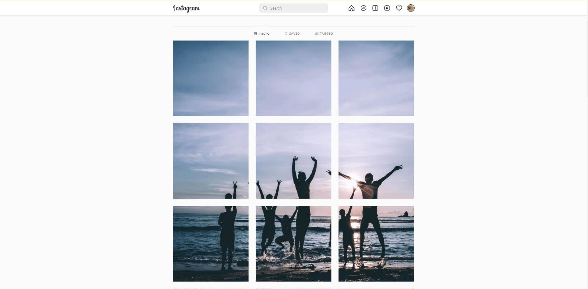

Instagram is a social network based on images and more recently on short format video (TikTok style) called stories.
But the base concept of Instagram was allways the images first and from the start Instagram' photos were squared.

## First problem
After some time Instagram adds other size and format of image[^instasize] but the profile grid was based on square image.

With this sizing some of the more creative instagram user create design base on the grid of image for making multiple post making a unique photo.

This trend continue with the creation of some app which create the posts' images from one single image

And now Instagram has portrait profile grid photo, breaking a lot of profile.
All of this because:

> 4:5 is the best ratio for video
>
> Official Instagram Storie about the update

## Second problem

Meta now has community note not fact checking[^communitynote].
So if i post a photo of my cat flying and I have a big community, I can say in the community note

> Cat can fly on Friday Afternoon but only when Mars is in the Fishes
>
> by Community Note

Why????

[^instasize]: Original announcment [Introducing Landscape and Portrait Formats on Instagram](https://about.instagram.com/blog/announcements/introducing-landscape-and-portrait-formats-on-instagram)
[^communitynote]: [Meta now has community note not fact check](https://about.fb.com/news/2025/01/meta-more-speech-fewer-mistakes/)

## Third problem

Instagram is pushing videos/reals every time they can. They want to be TikTok but they don't find the right way to do it...

I don't find the Instagram reals so interesting as the TikTok video so, if I want to see video I go to TikTok. If I want to see photo I go to Instagram

## Conclusion without a solution

All of this and the "success" of PiXelfed[^pixelfed] Instagram is loosing his apeal and more and more user aren't satisfied with the new "feature" they are implementing.

[^pixelfed]: [Social network](https://pixelfed.social/i/web) based on [ActivityPub protocol](https://en.wikipedia.org/wiki/ActivityPub)

I know it isn't a solution but more and more if we want to become indipendent from the social network you need to have a blog with our domain so you have the control of your internet's presence
