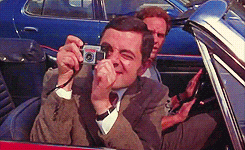
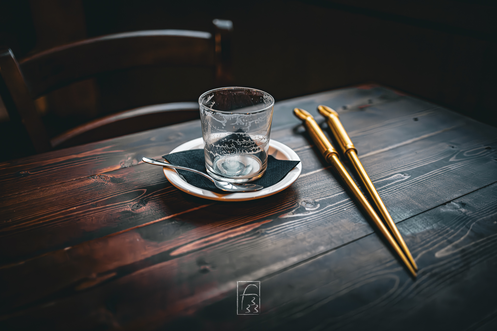
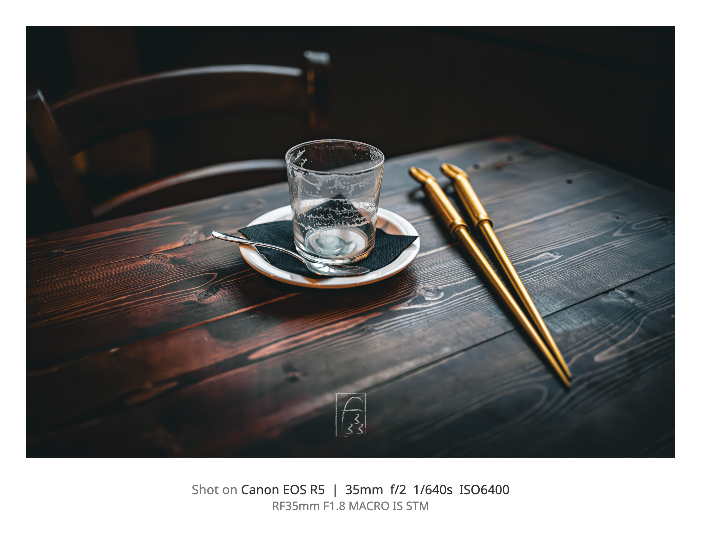
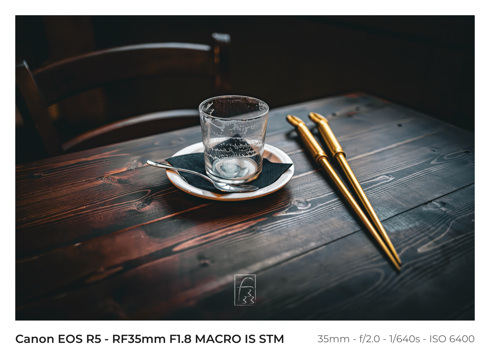

Some time ago I decide to make a photo exhibition in my city and, before doing it, I make some research of what I need to do.
So I made the photo exhibition with some errors here and there but I love it.[^1]
[^1]: If you want to see it you can find the info at [this site](https://matteoscarpa.it/in-piedi-da-solo/).



So I find a lot of photographeres having a white or black framing of the pic[^2] so I do it while printing (read as the source file has not framing but he printed one has one) but I want to have the source file with a frame and some info about the pic. So I search the web for something usefull.

[^2]: Not all type of pic, only the colored one, not the black and white's one

## What I need and want

I have this pic and I want to add the frame and some text under the pic but inside the frame.



For a pic like this I want info inside the frame:

- Camera info (camera model and companyß I taked the pic)
- Lens info (lens model and company)
- Camera and lens settings (aperture, iso, framerate )
- Camera and Lens info need to be clear and not a string of serial code
- The text under the pic is easy to read and don't take attention from the pic
- Must look professional
- I need to elaborate single picture but having also a directory mode is a good thing.

## First solution: make yourself with Photoshop or similar

First thing I fount are tutorial for Photoshop or other tool for this result. I hate this solution and it isn't batch ready.
I also find this method slow and prone to make me angry or paranoic about errors.

## Second solution: web page with a tool

After more searching I found some [external tool](https://benrilab.com/en/app/exif-styler/). It generates a good framing for the pic but has something I didn't like.



This is a online tool and I don't like to upload the photos and has some limit/problem when you upload big or a lot photos at the same time. And this is not a problem for a single site but a limitation you need to have for all the free tools.

## The best solution: coding

So in the end I wrote this little script:

- set the font and fit its size
- get the exif data (the lens, camera, ...)
- add the frame
- add the text if present
- use click for having a interactive cli for getting the input needed

with this packages as dipendency

```bash
pip install pillow piexif click
```
and the final code is this

```python
import os
import sys
from PIL import Image, ImageDraw, ImageFont
import piexif
import click

FONT_DIR = os.path.join(os.path.dirname(os.path.abspath(__file__)), "fonts")
BUNDLED_FONT = os.path.join(FONT_DIR, "Montserrat-Variable.ttf")


FALLBACK_FONTS = [
    "/System/Library/Fonts/Avenir Next.ttc",  # macOS
    "/System/Library/Fonts/HelveticaNeue.ttc",  # macOS
    "/usr/share/fonts/truetype/dejavu/DejaVuSans.ttf",  # Linux
    "/usr/share/fonts/truetype/liberation/LiberationSans-Regular.ttf",  # Linux
    "C:\\Windows\\Fonts\\segoeui.ttf",  # Windows
    "arial.ttf",
]


CAMERA_WEIGHT = 600
CONFIG_WEIGHT = 400
CONFIG_SIZE_RATIO = 0.85


def load_font(size, weight):
    """Load a font for the shot info, falling back to elegant alternatives."""
    try:
        font = ImageFont.truetype(BUNDLED_FONT, size)
        font.set_variation_by_axes([weight])
        return font
    except Exception:
        pass

    for path in FALLBACK_FONTS:
        try:
            return ImageFont.truetype(path, size)
        except (IOError, OSError):
            continue

    return ImageFont.load_default(size=size)


def fit_font(draw, text, size, weight, max_width, min_size=10):
    """Shrink the font size until the text fits within max_width."""
    font = load_font(size, weight)
    if not text:
        return font
    text_width = draw.textlength(text, font=font)
    if text_width <= max_width or size <= min_size:
        return font
    smaller_size = max(min_size, int(size * max_width / text_width))
    return load_font(smaller_size, weight)


def get_exif_data(image_path):
    """Extract the main EXIF shot data from the image."""
    exif_data = {
        "make": "",
        "model": "",
        "lens": "",
        "fstop": "",
        "shutter": "",
        "iso": "",
        "focal": "",
    }

    try:
        exif_dict = piexif.load(image_path)

        # Camera
        if "0th" in exif_dict:
            ifd0 = exif_dict["0th"]
            if piexif.ImageIFD.Make in ifd0:
                exif_data["make"] = (
                    ifd0[piexif.ImageIFD.Make].decode("utf-8", errors="ignore").strip()
                )
            if piexif.ImageIFD.Model in ifd0:
                exif_data["model"] = (
                    ifd0[piexif.ImageIFD.Model].decode("utf-8", errors="ignore").strip()
                )

        if "Exif" in exif_dict:
            exif = exif_dict["Exif"]
            # Lens
            if piexif.ExifIFD.LensModel in exif:
                exif_data["lens"] = (
                    exif[piexif.ExifIFD.LensModel]
                    .decode("utf-8", errors="ignore")
                    .strip()
                )

            # Aperture (F-Number)
            if piexif.ExifIFD.FNumber in exif:
                fnum = exif[piexif.ExifIFD.FNumber]
                if isinstance(fnum, tuple) and fnum[1] != 0:
                    exif_data["fstop"] = f"f/{fnum[0] / fnum[1]:.1f}"

            # Shutter Speed
            if piexif.ExifIFD.ExposureTime in exif:
                exp = exif[piexif.ExifIFD.ExposureTime]
                if isinstance(exp, tuple) and exp[1] != 0:
                    if exp[0] >= exp[1]:
                        exif_data["shutter"] = f"{int(exp[0] / exp[1])}s"
                    else:
                        exif_data["shutter"] = f"{exp[0]}/{exp[1]}s"

            # ISO
            if piexif.ExifIFD.ISOSpeedRatings in exif:
                exif_data["iso"] = f"ISO {exif[piexif.ExifIFD.ISOSpeedRatings]}"

            # Focal Length
            if piexif.ExifIFD.FocalLength in exif:
                focal = exif[piexif.ExifIFD.FocalLength]
                if isinstance(focal, tuple) and focal[1] != 0:
                    exif_data["focal"] = f"{int(focal[0] / focal[1])}mm"

    except Exception:
        # Silent if there is no EXIF data, fields remain empty
        pass

    return exif_data


def build_camera_label(make, model):
    """Combine make and model while avoiding duplication (e.g. 'Canon EOS R5')."""
    make = make.strip()
    model = model.strip()
    if not model:
        return make
    if not make or model.lower().startswith(make.lower()):
        return model
    return f"{make} {model}"


def process_single_image(image_path, output_path, border_size_pct, bottom_border_pct):
    """Add the white border and EXIF data to a single image.

    Returns "ok", "skipped" (no EXIF data) or "error".
    """
    try:
        img = Image.open(image_path)
        if img.mode != "RGB":
            img = img.convert("RGB")
    except Exception as e:
        click.echo(f"Error opening {image_path}: {e}", err=True)
        return "error"

    exif = get_exif_data(image_path)
    if not any(exif.values()):
        click.echo(f"No EXIF data found, skipping: {image_path}")
        return "skipped"

    width, height = img.size

    # Compute border size in pixels
    border_px = int(min(width, height) * border_size_pct)
    bottom_px = int(min(width, height) * bottom_border_pct)

    # New overall dimensions
    new_width = width + (border_px * 2)
    new_height = height + border_px + bottom_px

    # Create the white canvas
    canvas = Image.new("RGB", (new_width, new_height), "white")
    canvas.paste(img, (border_px, border_px))

    # Build the text strings: make/model (+ lens) on the left, config on the right
    camera_parts = [build_camera_label(exif["make"], exif["model"]), exif["lens"]]
    camera_text = " - ".join(p for p in camera_parts if p)

    config_parts = [exif["focal"], exif["fstop"], exif["shutter"], exif["iso"]]
    config_text = " - ".join(p for p in config_parts if p)

    draw = ImageDraw.Draw(canvas)
    font_size = max(1, int(bottom_px * 0.32))
    config_size = max(1, int(font_size * CONFIG_SIZE_RATIO))
    available_width = new_width - 2 * border_px
    gap = int(bottom_px * 0.2)

    camera_font = load_font(font_size, CAMERA_WEIGHT)
    config_font = load_font(config_size, CONFIG_WEIGHT)
    camera_w = draw.textlength(camera_text, font=camera_font) if camera_text else 0
    config_w = draw.textlength(config_text, font=config_font) if config_text else 0

    x_left = border_px
    x_right = new_width - border_px

    if camera_text and config_text and camera_w + gap + config_w > available_width:
        # Don't fit side by side: stack them on two lines to avoid overlap
        camera_font = fit_font(
            draw, camera_text, font_size, CAMERA_WEIGHT, available_width
        )
        config_font = fit_font(
            draw, config_text, config_size, CONFIG_WEIGHT, available_width
        )
        y_top = height + border_px + int(bottom_px * 0.35)
        y_bottom = height + border_px + int(bottom_px * 0.7)
        draw.text(
            (x_left, y_top),
            camera_text,
            fill=(30, 30, 30),
            font=camera_font,
            anchor="lm",
        )
        draw.text(
            (x_left, y_bottom),
            config_text,
            fill=(100, 100, 100),
            font=config_font,
            anchor="lm",
        )
    else:
        y_center = height + border_px + bottom_px // 2
        if camera_text:
            draw.text(
                (x_left, y_center),
                camera_text,
                fill=(30, 30, 30),
                font=camera_font,
                anchor="lm",
            )
        if config_text:
            draw.text(
                (x_right, y_center),
                config_text,
                fill=(100, 100, 100),
                font=config_font,
                anchor="rm",
            )

    # Save the result
    canvas.save(output_path, "JPEG", quality=95)
    return "ok"


@click.command()
@click.argument(
    "path", type=click.Path(exists=True, file_okay=True, dir_okay=True, readable=True)
)
@click.option(
    "--output",
    "-o",
    type=click.Path(),
    help="Destination file or folder. If omitted, creates an 'output' folder.",
)
@click.option(
    "--border",
    "-b",
    default=0.05,
    type=float,
    help="Side/top border thickness as a percentage (e.g. 0.05 = 5%).",
)
@click.option(
    "--bottom",
    "-bt",
    default=0.12,
    type=float,
    help="Bottom border thickness for the text as a percentage (e.g. 0.12 = 12%).",
)
def main(path, output, border, bottom):
    """Add white borders and EXIF info to your photos.

    PATH can be the path to a single image file or a folder.
    Images with no EXIF data are skipped (no border added).
    """
    extensions = (".jpg", ".jpeg", ".png", ".tiff", ".webp")

    # Handle a single FILE input
    if os.path.isfile(path):
        if not path.lower().endswith(extensions):
            click.echo("The given file is not a supported image.", err=True)
            sys.exit(1)

        if not output:
            dirname, filename = os.path.split(path)
            output = os.path.join(dirname, f"bordered_{filename}")
        elif os.path.isdir(output):
            output = os.path.join(output, os.path.basename(path))

        click.echo(f"Processing file: {path}")
        result = process_single_image(path, output, border, bottom)
        if result == "ok":
            click.echo(f"Saved successfully to: {output}")

    # Handle a FOLDER input
    elif os.path.isdir(path):
        if not output:
            output = os.path.join(path, "output_bordered")

        os.makedirs(output, exist_ok=True)

        # List all valid files in the folder
        files = [f for f in os.listdir(path) if f.lower().endswith(extensions)]

        if not files:
            click.echo("No valid images found in the folder.")
            sys.exit(0)

        click.echo(
            f"Found {len(files)} images in the folder. Starting processing..."
        )

        skipped = 0
        errors = 0
        with click.progressbar(files, label="Progress") as bar:
            for file_name in bar:
                input_file_path = os.path.join(path, file_name)
                output_file_path = os.path.join(output, file_name)
                result = process_single_image(
                    input_file_path, output_file_path, border, bottom
                )
                if result == "skipped":
                    skipped += 1
                elif result == "error":
                    errors += 1

        click.echo(f"All images have been saved to the folder: {output}")
        if skipped:
            click.echo(f"{skipped} images skipped (no EXIF data).")
        if errors:
            click.echo(f"{errors} images failed to process due to errors.", err=True)


if __name__ == "__main__":
    main()

```

And this is the script output from the example pic.



I will change something because I not full ok with how the text is print on the frame (font size etc...) but this is the best I have in this moment.
