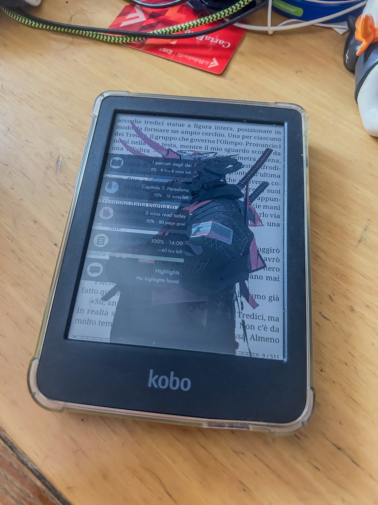
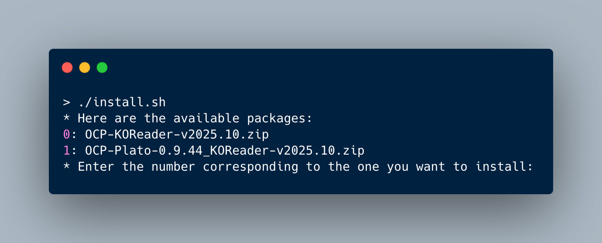
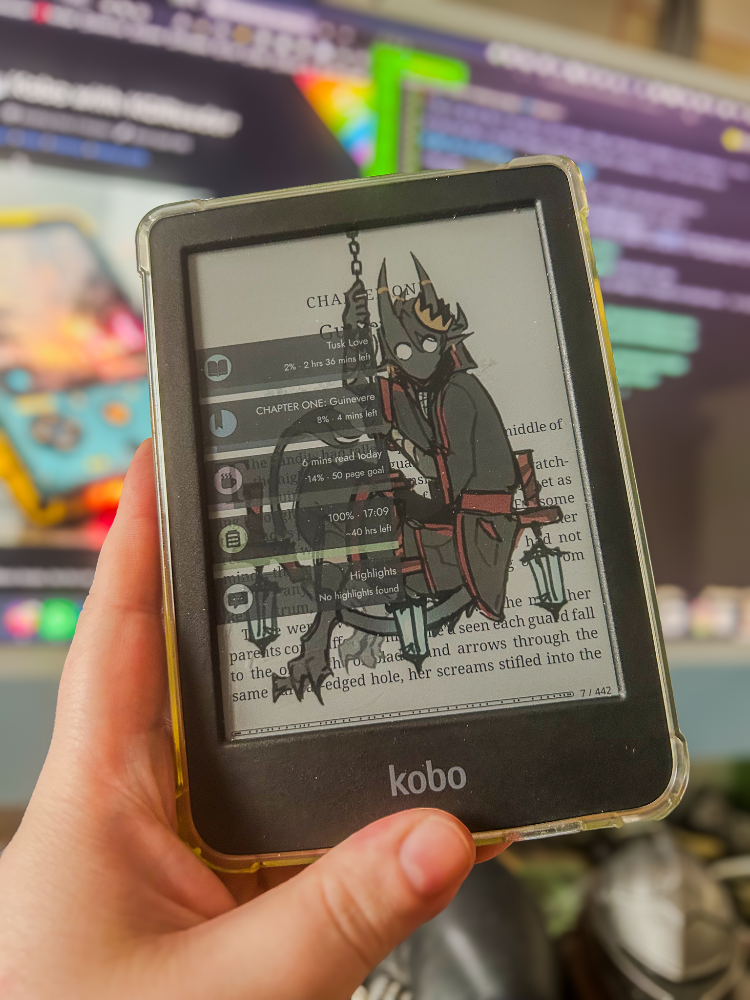

A long long time ago I start using a EBook Reader, the first Kindle PaperWhite (2012) and I never stop using EReader.

The last one I own is a Kobo Clara Colour, this one.

I love it and the fact I can read in color comics, manga, web comics and graphic novel everywhere is a plus.

But more and more I use Ebook Readers more and more I want to customize it. Like I have in the pic.

## What can I do? What do I want to do with my Kobo?

I have some task and prerequisite for my Ebook Reader so I check an Hack which resolve all:

- _I need to sync with Calibre_: I have an huge Calibre Library and I want to keep it
- _Change the default cover_: I want my cover, not the default covers
- _Integration with GoodRead or Hardcover_: I want to sync with GoodRead or Hardover the data from my ebook reader.
- _Open Source software_: I want to use an Open Source project because I can code so if i need something I can code it.

So I did some research on the web and find KoReader[^KoReader].

[^KoReader]: [KoReader](https://github.com/koreader/koreader) Github official page

It is a software which, after installing on the ereader, it add support for plugins and custom covers... So I start with it.

## How to install it?

Searching for the wiki page for starting/installing I found some tread about the installation[^installation] and I follow them. Here I rewrite all the steps with newer link for the stuff needed and rewrote some step because the two treads aren't clear enough for me.

[^installation]: [Install Tread part1](https://www.mobileread.com/forums/showpost.php?p=3797095&postcount=1) and [Install Tread part2](https://www.mobileread.com/forums/showpost.php?p=3797096&postcount=2)

0. Check if your device support the software
1. Download the last version of what you want to install. In this case [Last version of KoReader](https://github.com/koreader/koreader/releases) is what I want and support on my device
2. Put all the zip/archive you download in a new directory without unarchive anything
3. Download the installer script ([Windows version](https://raw.githubusercontent.com/NiLuJe/kfmon/refs/heads/master/tools/install.ps1), [Mac version](https://raw.githubusercontent.com/NiLuJe/kfmon/refs/heads/master/tools/install.sh), [Linux version](https://raw.githubusercontent.com/NiLuJe/kfmon/refs/heads/master/tools/install.sh)) and put in the same directory as all the other stuff downloaded in 2
4. Plug in the Kobo and check if you can read and write file inside it
5. If needed fix the permission for execute the installer download at step 3
6. Follow the on-screen instruction and close the terminal when done
7. Safely eject your Kobo, watch it process (it look like in some way a glitching and crashing device but it need to look like that) and waite for the end of the reboot.

If you have doubt, here is a screenshot of what the terminal look like in step 6 if you did all in the right way.

After the reboot of the device I start to add the plugins for some customization

## Adding stuff

I add some KoReader Plugin, which you need to install.

All the plugin are installed in the same way:

1. You need to download the plugin
2. You need to extract the *plugin_name*.koplugin
3. Edit any config file for the plugin (only some plugin required this)
4. Put the koplugin folder in the path for the device (in Kobo case is **.adds/koreader/plugins**)
5. Restart KOReader

- [ProjectTitle KOReader](https://github.com/joshuacant/ProjectTitle) for a better looking homepage for KOReader (needed)
- [Customisable Sleep Screen](https://github.com/pxlflux/customisablesleepscreen.koplugin) for having a customisable sleep screen (as the name of the plugin say)
- [Hardcover.app for KOReader](https://github.com/Billiam/hardcoverapp.koplugin) for sync the data with my [HardCover](https://hardcover.app/) account

I also create some image with trasparent background for having this type of cover, where you can see under the sleep-screen what are you reading.

## And I did more

I did a lot of configuration inside of KOReader for this or that component and I don't want to lose all. So, after asking Reddit [How can I make a backup?](https://www.reddit.com/r/koreader/comments/1sgk3zc/comment/of5k8qe/) and make this script.

~~~ python
#!/usr/bin/env python3

import os
import sys
import shutil
from datetime import datetime

KOREADER_DIR = ".adds"
BACKUP_DESTINATION = "~/BackUp/KoReader"
BACKUP_FILENAME = "koreader_backup_{date}.zip"

def find_kobo_device():
    """Find the path to the Kobo"""
    volumes_path = "/Volumes"

    if os.path.exists(volumes_path):
        for entry in os.listdir(volumes_path):
            full_path = os.path.join(volumes_path, entry)
            if os.path.isdir(full_path):
                try:
                    contents = os.listdir(full_path)
                    if ".kobo" in contents:
                        return full_path
                except PermissionError:
                    continue

    return None

def get_koreader_path(kobo_path):
    """Returns the path to KoReader on the Kobo."""
    return os.path.join(kobo_path, KOREADER_DIR)

def create_backup(source_path, backup_destination):
    """Creates a zip backup of KoReader."""
    if not os.path.exists(source_path):
        print(f"Error: KoReader not found in {source_path}")
        return False

    print(f"Creating backup from: {source_path}")

    date_str = datetime.now().strftime("%Y%m%d_%H%M%S")
    backup_filename = BACKUP_FILENAME.format(date=date_str)
    backup_path = os.path.join(backup_destination, backup_filename)

    print(f"Backup to: {backup_path}")

    try:
        shutil.make_archive(
            backup_path.replace(".zip", ""), "zip", root_dir=source_path, base_dir="."
        )
        print(f"Backup created: {backup_path}")
        return True
    except Exception as e:
        print(f"Error during backup creation: {e}")
        return False

def main():
    kobo_path = find_kobo_device()

    if not kobo_path:
        print("Kobo not found. Connect the device and try again.")
        sys.exit(1)

    print(f"Kobo found at: {kobo_path}")

    koreader_path = get_koreader_path(kobo_path)
    backup_destination = os.path.expanduser(BACKUP_DESTINATION)
    os.makedirs(backup_destination, exist_ok=True)

    success = create_backup(koreader_path, backup_destination)

    if success:
        print("Backup completed successfully!")
    else:
        print("Backup failed.")
        sys.exit(1)

if __name__ == "__main__":
    main()

~~~

This Python script is run every time I connect to my computer with the Kobo and copy the **.adds** in a specific path with a new folder tagged with the timestamp.

So if I break my KOReader config, I can reset all and copy the **.adds** for restore the KOReader.

## Conclusion

For now this is what I did with my Kobo but I am thinking new stuff so if I will do something new I will write about it.
