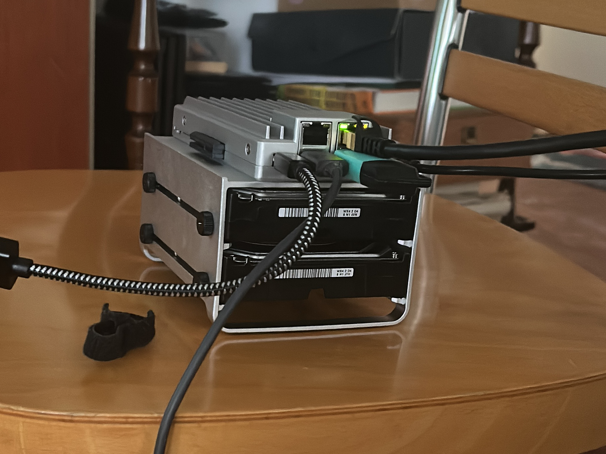
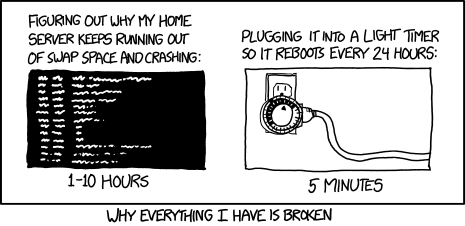
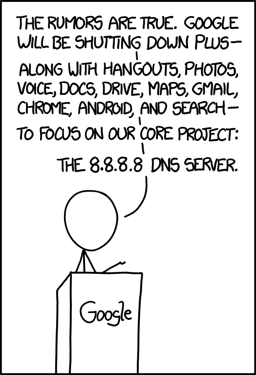

And after some searching and some buying (and some exchange with sombody I know) I built my HomeLab core/main server.[^1]

[^1]: Searching for a name for the server. If you have one comment this post with it thanks.

"It" is
- ZimaBoard2 [^2]
- 2 WD Red Plus Internal NAS HDD 3.5 4 TB[^3]

I set the HDD in Raid1 for replication and I install ProxMox VE as OS[^4]. The installation software for the distro make the RAID1 for my HDDs.

[^2]: Suggestion from a friend to have it as a main server. [ZimaBoard2](https://www.zimaspace.com/it/products/single-board2-server) will be the main server and controller for the all system (for now)
[^3]: This specific HDD are for NAS or Server soo... I take what I can buy [link](https://www.westerndigital.com//products/internal-drives/wd-red-plus-sata-3-5-hdd?sku=WD40EFZZ)
[^4]: [ProxMox VE](https://pve.proxmox.com/wiki/Main_Page) is a Debian (❤️‍🔥) base distribution for manage virtualization.

After some problem (I only have the TV as monitor and I don't have very long cable) I had a working HomeLab for start.

## The start

Now I all setup (the hardware) I connect it to my local lan and start to toy with ProxMox. First thing it don't have a custom domain... I have ProxMox on a ip and I don't like it. So I need to have a local DNS with a proxy and a domain (for a cert) and it need to work only in my local network. And I need to be all working after rebooting the system (if I have a energy problem) without man assistant.

## The NPM: Nginx Proxy Manager

The fist software I install is a proxy for redirect an url into a ip+port. Why? Because all the service I build are expose as an ip+port and I don't want to learn a lot of ip, I want something more like 'rss.mydomain.com' or 'proxmox.mydom.com'.

So I start searching the script for the Nginx Proxy Manager in the Community scripts[^5] and following the instruction I build the LXC container with NPM inside on my proxmox server.

[^5]: [Community-driven scripts for Proxmox VE and Incus](https://community-scripts.org/) — browse, install, and manage containers and VMs with a single command.

After the install and the post install I wrote down the ip (and the port if isn't a standard one) and I choose my personal domain for the HomeLab.

For the one with short term memory (like me) at this point in time I have

- A router at 192.168.1.1
- A ProxMox at 192.168.1.176:8006
- A NPM at 192.168.1.209:81
- A domain f333lab.com
- A Cloudflare free account

And I want

- ProxMox at prox.f333lab.com
- NPM ar nginx.f333lab.com
- All the service with HTTPS and cert

So we start with the config for the NPM

### Config the proxy

I start config the NPM for the first:

- I added the domain in Cloudflare and take the api for edit that domain[^6]
- I added the domain in the Certificates tab (in the top menu of NPM) as
  - *.f333lab.com with Cloudflare as provider (here is where i put the api key)
  - f333lab.com with Cloudflare as provider (here is where i put the api key)
- I added nginx.f333lab.com as
  - Scheme as http
  - Forward 127.0.0.1
  - Port 81
  - Force SSL
  - SSL Certificate *.f333lab.com

[^6]: [Here](https://dash.cloudflare.com/profile/api-tokens) the link for getting the token

Some explanation are needed.

#### Why Cloudflare?

I need to use Cloudflare for generating a cert without having my server expose to the wild web. With this I can have the https for all my service and with autorenew for the certs.

#### Why two certs for one domain?

I add two cert because:
- the main domain will be use for the dashboarb/hub for the link for all the service I host in my HomeLab
- the * domain will be use for all the service (they will be all subdomain of the domain)

#### Why 127.0.0.1 and not 192.168.1.209 ?

If I set 127.0.0.1 as forward ip I can change the ip of the LXC without edit anything else and will allways work.

## And now DNS time

After setting the proxy I need a local DNS. And if it has more (spam filter, malware/phishing blocker...) it can be a better choise.

After some searching I found Adguard[^adguard] and can be installed with a LXC script from the same repo/project as NPM.

[^adguard]: [Link](https://adguard.com) of the official site of the software

After installing it we have

- A router at 192.168.1.1
- A domain f333lab.com
- ProxMox at prox.f333lab.com
- NPM ar nginx.f333lab.com
- Adguard installed at 192.168.1.129:80

I want

- Adguard set as the DNS for my local network
- Adguard at adguard.f333lab.com
- All service *.f333lab.com manage by the DNS

### Adguard config

First I need to set the NPM and the router
- I added adguard.f333lab.com as
  - Scheme as http
  - Forward 192.168.1.129 or the domain of the NPM
  - Port 80
  - Force SSL
  - SSL Certificate *.f333lab.com
- Set in Adguard the alternative DNS with your favorites (in my case 8.8.8.8 and 1.1.1.1)
- Set in the router the DNS as 192.168.1.129 with the MAC address you find in proxmox-network info for the LXC

After some time for all the device in the network to update the DNS AdGuard will be your bottolneck and Holy DNS for your network.

If you want to add a "local service" as url you must:

- Set it in NPM (for example I set adguard.f333lab.com and nginx.f333lab.com in this post)
- Add the cert in the NPM for the domain (is one of the step I did setting adguard.f333lab.com and nginx.f333lab.com in this post)
- Add in the __#dns_rewrites__ the domain you want forwarding to the NPM ip or the domain

I also tinkering with the AdGuard setting for config some antispam and other security stuff for more security for my network.

#### Why i can put nginx.f333lab.com in place of the domain?

You can put it because all you need is forwarding the subdomain to the NPM/proxie. In my case I can use nginx.f333lab.com for all the case (not for nginx.f333lab.com itself) because it forword to the proxie

## And now?

And now I have a HomeLab with what I consider a basic config for it working. Yes, I need more stuff like a backup system and other utility but for now I have a starter configuration and I will post more about in the future.
