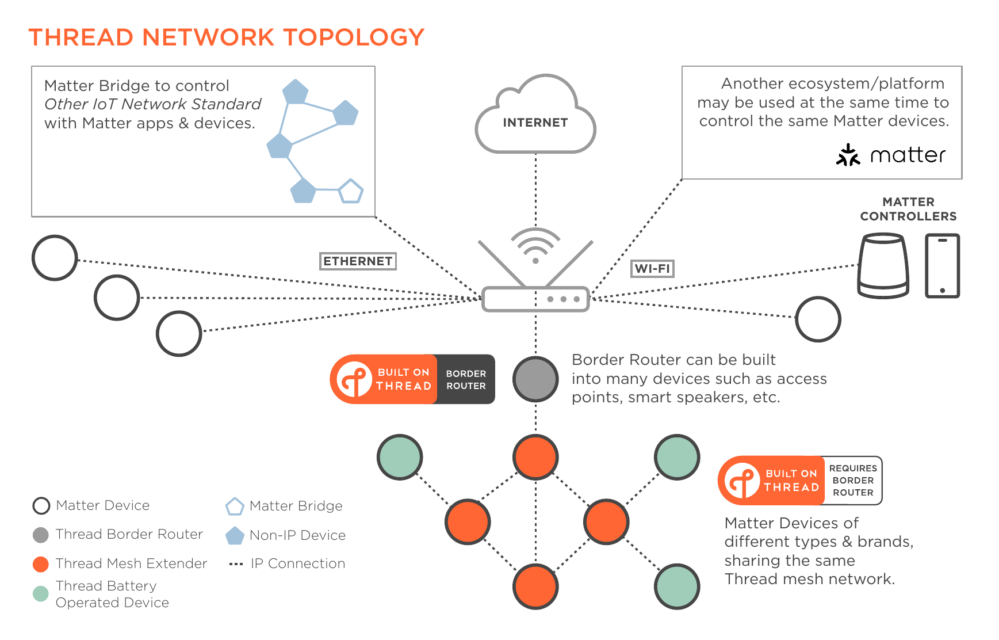
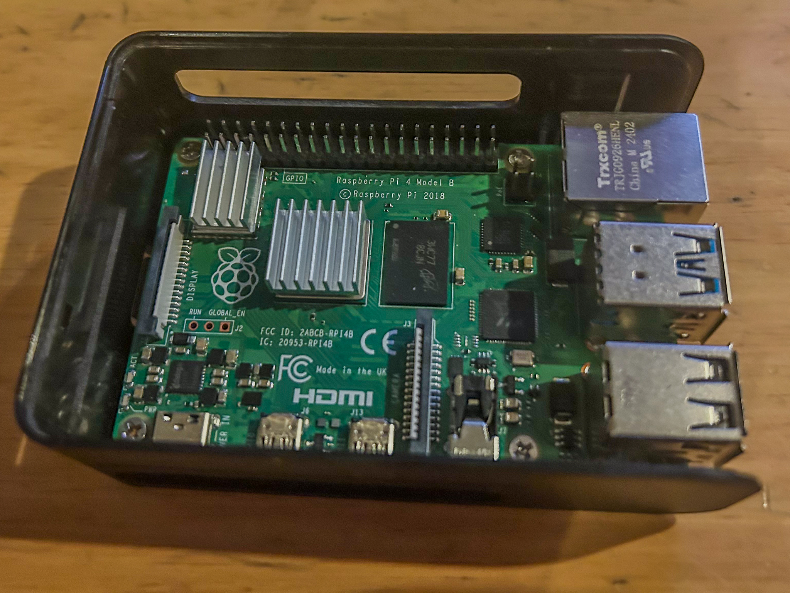
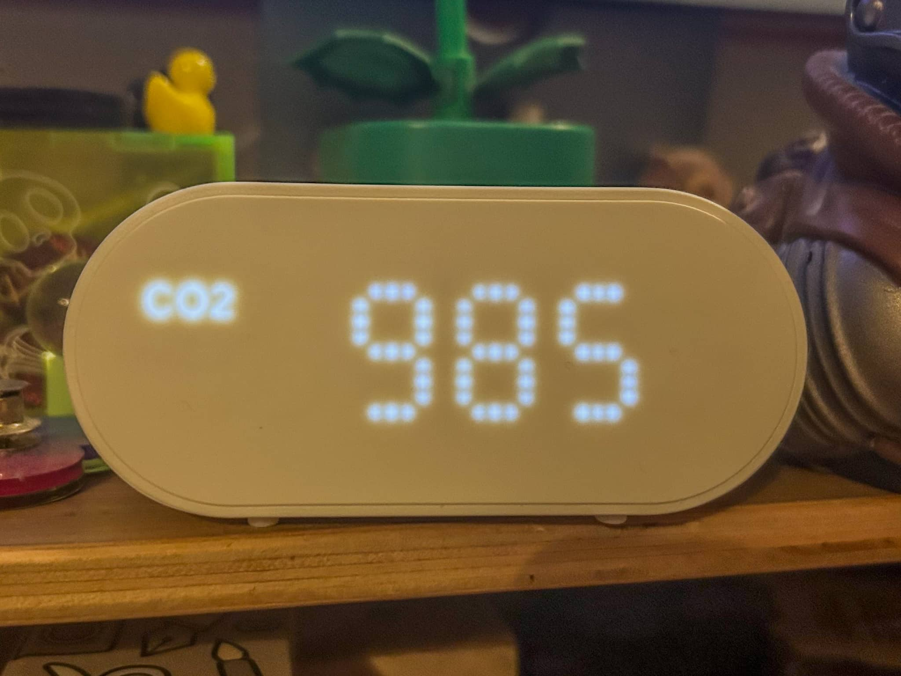
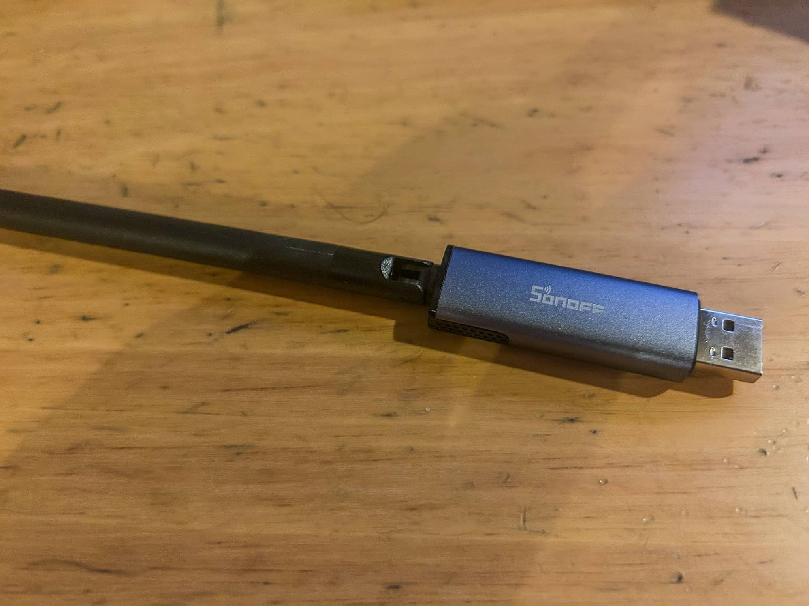
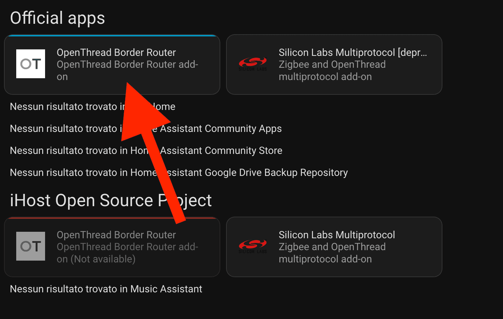
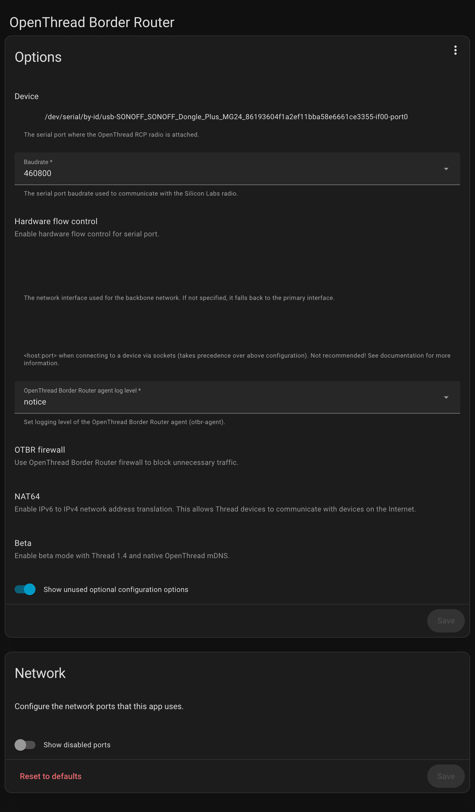
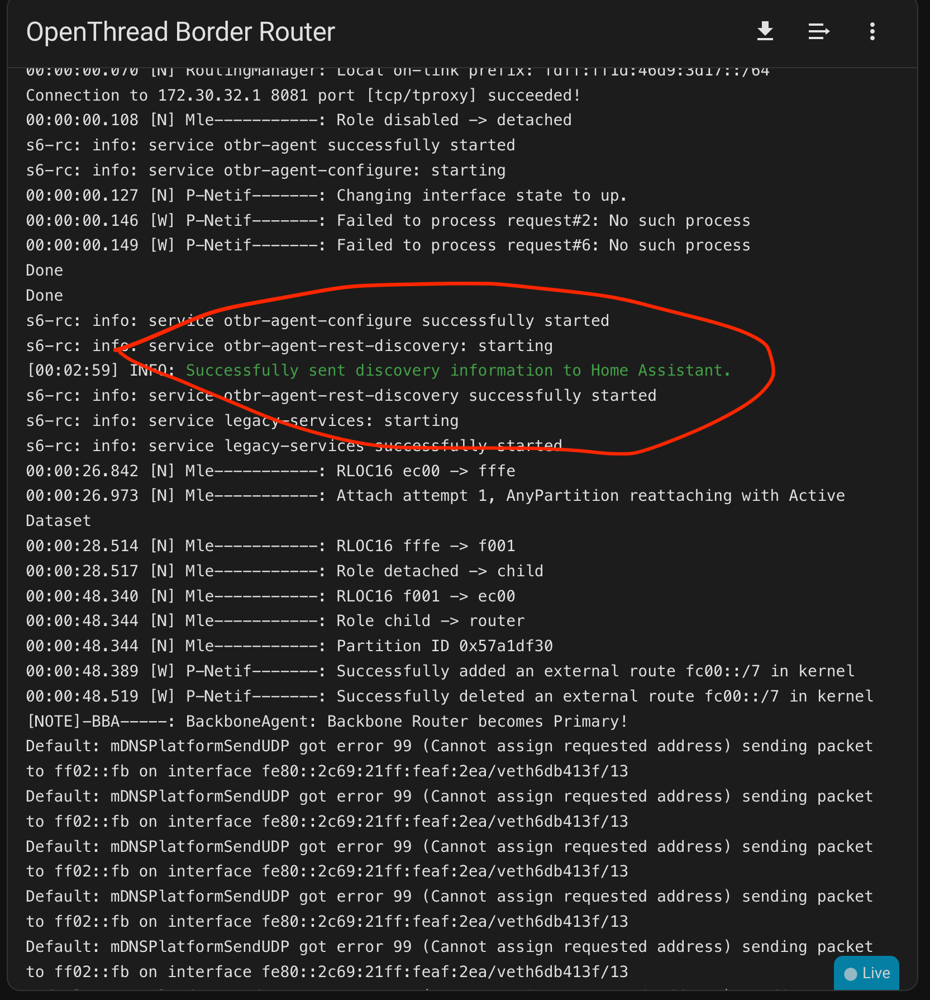

And some time ago I installed the Fiber[^1] in my home and I want to use in the best way, so I start to rework all my local network and I think about adding some home automation.

[^1]: I pay a company to install it and I clean after.



## What do I need?

First I search for understand what I need to have for build my personal home automation. So serching on the web I found I need:

- A brain/core/server for coordinate all the stuffs
- A software for the brain, for the automation  and other stuff
- A router for adding the brain to the network for update and other stuff
- Dongle/sensor/tech for connectivity with the sensors and smart stuff (one for protocol)
- The smart stuff (light bulb, sensor, timer, endpoint api...)

So I need to choose which protocol I want in my home... And I don't know...

So I change the point of view:

- I want to use good smart stuff but I don't want to pay too much
- I want something Open Source so I am not bind to a company
- I want something offline or/and on MY HOME SERVER

### The protocols

Searching for the protocols I choose Thread[^thread-standard] and Zigbee[^zigbee].
One reason is because they are the most used protocol for communication and more easy to find online (Amazon) and offline (Ikea and othe local shop).

For starting I will implement only Thread because the more easy tech for me are all Matter over Thread so I start with Thread.

From the infographic I found, I need to implement Matter[^matter-standard] also because Matter is the top stuff for an Home Assistant.

[^matter-standard]: [Matter Standard](https://csa-iot.org/all-solutions/matter/)
[^thread-standard]: [Thread Standard](https://threadgroup.org/)
[^zigbee]: [Zigbee Standard](https://csa-iot.org/all-solutions/zigbee/)

### The software

Now I want a software, Open Source, which I can support Thread and Matter (and also Zigbee) and I found a software (Open Source) wich support all I need: Home Assistant[^home-assistant].

It support Matter[^matter-home-assistant], Thread[^thread-home-assistant] and Zigbee[^zigbee-home-automation] and I can put it in a RaspberryPi or other server.

[^home-assistant]: [Home Assistant](https://www.home-assistant.io/)
[^matter-home-assistant]: [Home Assistant Matter](https://www.home-assistant.io/integrations/matter/)
[^thread-home-assistant]: [Home Assistant Thread](https://www.home-assistant.io/integrations/thread/)
[^zigbee-home-automation]: [Zigbee Home Automation](https://www.home-assistant.io/integrations/zha/)

## Hardware

So I start to make a list of what I have and what I need.
Some things I buy online, some things come from some tech market and some come form the shoes box of my old stuff...

I only write about the real things but if I use cable or other "standard stuff" I don't write about it.
So yes I bought some usb extention and some network cable but they aren't important for this post.

### Core/Brain Stuff

First I need the Brain for the project

From what I read in the Home Assistant[^home-assistant] documentation I need some type of server with some gadget connected to them.

So I search and  got a RaspberryPi 4B[^raspberry].

[^raspberry]: [RaspberryPi 4B](https://www.raspberrypi.com/products/raspberry-pi-4-model-b/)

I also bought a microSD with 64GB of memory (I am on a budget for this project) as an Hard Disk for the "server".

Searching in my closet and in some shoes boxes I found a case[^case] for RaspberryPi with active cooling system (and LGB light)

[^case]: [Raspberry Pi 4B Case from Owootecc](https://www.amazon.it/dp/B07YJGWPQL)

So I flash the microSD with the Home Assistant software. Thanks to the Raspberry Pi Software[^iso] choosing the right iso and flash it in the SD was a walk in the park.

[^iso]: [Raspberry Pi software](https://www.raspberrypi.com/software/)

After the flashing I set it up and add to my local network and check for update.

So the brain is ready!

### Sensor form Ikea

I went to Ikea for some stuff and some Swedish meatballs and I came back with an Ikea Alpstuga[^ikea].

It is a timer, air sensor with CO2 and PM2.5 sensor and output all of them and an Air Quality value.

[^ikea]: [Ikea Alpstuga](https://www.ikea.com/it/it/p/alpstuga-sensore-della-qualita-dellaria-smart-50604187/)

The only bad thing about it is the color but for the price I don't complain.

So after coming home I found it didn't work.

As is the RaspberryPi 4B do not support Thread or Zigbee without some type of specialized antenna...
I was understanding that the software use the wifi module of the RaspberryPi as a Zigbee/Thread emitter/reciver but no so I search on Amazon for the dongle for Thread.

### Antenna

I bought a Usb dongle[^antenna] for connecting the RaspberryPi and the other gadget in the house (for now only the Ikea one)

[^antenna]: [SONOFF Zigbee 3.0 USB Dongle Plus MG24](https://www.amazon.it/dp/B0FMJD288B)

[^antenna]

This antenna is a little special: you can flash it for changing it form Zigbee to Thread and vice versa so I start to config it.

#### Setup the Antenna

First I flash the antenna. I need to port from Zigbee to Thread[^flash_firmware] and with the online tool it was so easy I thought I did something wrong.

[^flash_firmware]: [Sonoff dongle flasher/](https://dongle.sonoff.tech/sonoff-dongle-flasher/)

After this I connect the dongle and start to config the Home Assistant.

First I need to have installed Thread  from "Add Integration" and it showed an empty list of device. This is correct because I didn't have a Thread router installed.

So we add a OpenRouter. How? Installing from the officials app of mine Home Assistant.

After this I edit the config in this way (the device was auto-finded) and I set this for my device. [^note]

[^note]: This config work for me, it can not work for you

For checking if all was ok I went and seach in the log for the OpenThread for a specific line.

After this I went to check if the Thread integration showed the Ikea sensor and it didn't show... Why? Because I am STUPID.

#### Setup the last little things

Alpstuga (my air sensor) is not Thread, is Matter over Thread, so I need to add the thing with the Matter integration. And with this last integration the system worked!

I am happy of this system? No. Why? I have the wrong time on the Alpstuga.

This thing I don't understand so I search online for understand how can I fix the time on the device.

I find this is a common problem with the Alpstuga device and someone made a Hacs[^hacs] plugin[^matter-time-synk] wich add a cron and a button for sync the Home Assistant's clock. I also add the plugin for integrate my Playstation Network in my Home Assistant[^psnetwork].

[^hacs]: [Home Assistant Hacs](https://www.hacs.xyz/)
[^matter-time-synk]: [Matter time synk](https://github.com/Loweack/Matter-Time-Sync/)
[^psnetwork]: [PlayStation Network Home Assistant](https://www.home-assistant.io/integrations/playstation_network/)

## Conclusion

For now this is what I had done but I want to have automation (for now I don't have any) and some stuff for lower the gas bill so there will be more post about my smart home.
