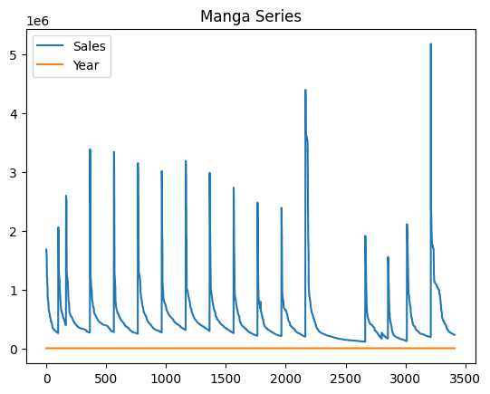

## The idea

I want to test some of the pandas functionality so I try the import from HTML table for make some data analisys.
So I choose a web page with data in a table (or two in this case)


```python
import matplotlib
import pandas as pd

```

Here we have the basic import for the needed package for the project.


```python
url = "https://www.mangacodex.com/oricon_yearly.php?title_series=&year_series=All&title_volumes=&year_volumes=All"

pd.set_option("display.precision", 2)
```

Some basic config (the log, the url,...) for my little script. I allwayse put at the top of the file for easy edit of them, if needed.


```python
print("Downloading data from the page...")
tables = pd.read_html(url, thousands='.', decimal =',')
print(f"Found {len(tables)} tables on the page.")

df1 = pd.DataFrame(tables[0])
print(type(df1))
df2 = pd.DataFrame(tables[1])
print(type(df2))
```

    Downloading data from the page...
    Found 2 tables on the page.
    <class 'pandas.DataFrame'>
    <class 'pandas.DataFrame'>


Starting with the scrape of the page with Pandas. In this case it returnes 2 table in pandas.DataFrame


```python
if len(tables) >= 2:
    table_series = tables[0]
    table_volumes = tables[1]

else:
    print("Error: The page does not contain enough tables.")
    raise Error
```

And now we have the two table as pandas Dataframe. Are there some empty data?


```python
print("-*-" * 20)
print("Missing value stats for Series:")
print(table_series.isnull().sum())
print()
print("-*-" * 20)
print("Missing value stats for Volumes:")
print(table_volumes.isnull().sum())
```

    -*--*--*--*--*--*--*--*--*--*--*--*--*--*--*--*--*--*--*--*-
    Missing value stats for Series:
    Ranking    0
    Title      0
    Sales      0
    Year       0
    dtype: int64

    -*--*--*--*--*--*--*--*--*--*--*--*--*--*--*--*--*--*--*--*-
    Missing value stats for Volumes:
    Ranking    0
    Volume     0
    Sales      0
    Year       0
    dtype: int64


## Start the analysis

So we know the data is consistant so we need to know some generic data about this two dataset.


```python
print("-*-")
print(table_series.head())
print(table_series.info(verbose=False))
print()
print("-*-")
print(table_volumes.head())
print(table_volumes.info(verbose=False))

```

    -*-
       Ranking          Title    Sales  Year
    0        1  One Piece #50  1678208  2008
    1        2  One Piece #51  1646978  2008
    2        3       Nana #19  1645128  2008
    3        4  One Piece #49  1544000  2008
    4        5       Nana #20  1431335  2008
    <class 'pandas.DataFrame'>
    RangeIndex: 3413 entries, 0 to 3412
    Columns: 4 entries, Ranking to Year
    dtypes: int64(3), str(1)
    memory usage: 106.8 KB
    None

    -*-
       Ranking             Volume    Sales  Year
    0        1          One Piece  5956540  2008
    1        2             Naruto  4261054  2008
    2        3  20th Century Boys  3710054  2008
    3        4     Hitman Reborn!  3371618  2008
    4        5             Bleach  3161825  2008
    <class 'pandas.DataFrame'>
    RangeIndex: 860 entries, 0 to 859
    Columns: 4 entries, Ranking to Year
    dtypes: int64(3), str(1)
    memory usage: 27.0 KB
    None


```python
table_series[["Title","Sales","Year"]].plot(title="Manga Series")
```


    <Axes: title={'center': 'Manga Series'}>





```python

```
