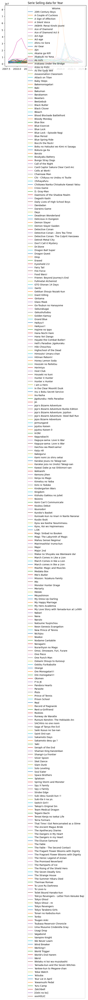
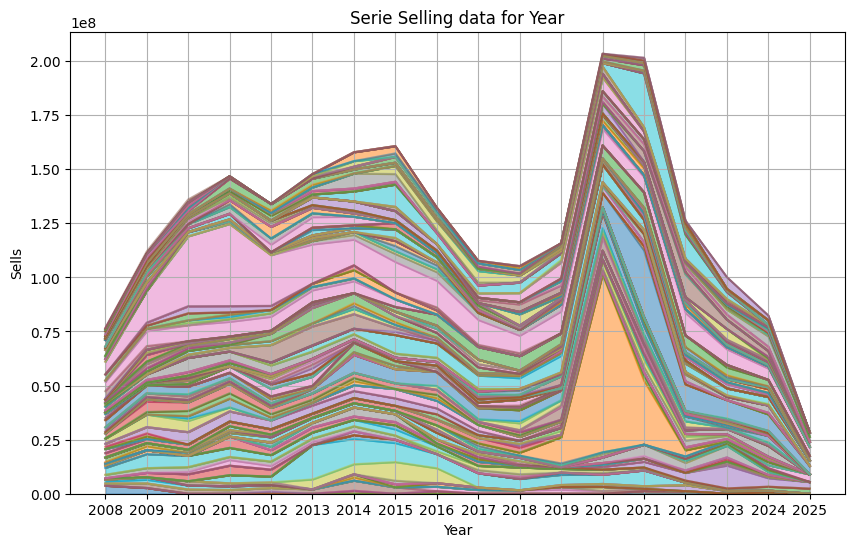
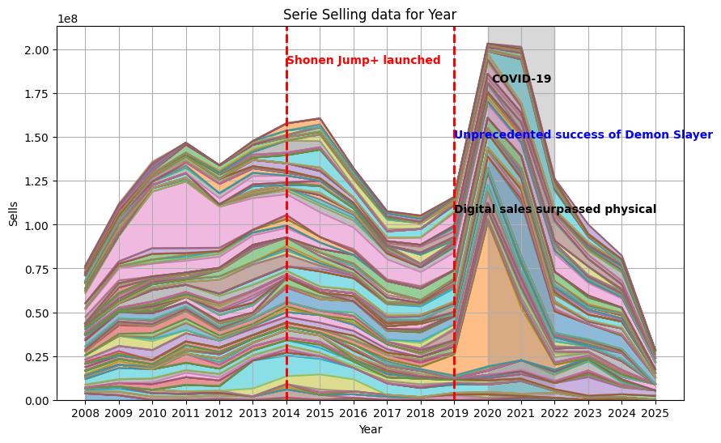

## The idea

I want to test some of the pandas functionality so I try the import from HTML table for make some data analisys.
So I choose a web page with data in a table (or two in this case) about manga.


```python
import matplotlib
import pandas as pd
import matplotlib.pyplot as plt
import numpy as np
```

Here we have the basic import for the needed package for the project.


```python
url = "https://www.mangacodex.com/oricon_yearly.php?title_series=&year_series=All&title_volumes=&year_volumes=All"

pd.set_option("display.precision", 2)
```

Some basic config (the log, the url,...) for my little script. I allwayse put at the top of the file for easy edit of them, if needed.


```python
print("Downloading data from the page...")
tables = pd.read_html(url, thousands='.', decimal =',')
print(f"Found {len(tables)} tables on the page.")

df1 = pd.DataFrame(tables[0])
print(type(df1))
df2 = pd.DataFrame(tables[1])
print(type(df2))
```

    Downloading data from the page...
    Found 2 tables on the page.
    <class 'pandas.DataFrame'>
    <class 'pandas.DataFrame'>


Starting with the scrape of the page with Pandas. In this case it returnes 2 table in pandas.DataFrame


```python
if len(tables) >= 2:
    table_series = tables[1]
    table_volumes = tables[0]

else:
    print("Error: The page does not contain enough tables.")
    raise Error
```

And now we have the two table as pandas Dataframe. Are there some empty data?


```python
print("-*-" * 20)
print("Missing value stats for Series:")
print(table_series.isnull().sum())
print()
print("-*-" * 20)
print("Missing value stats for Volumes:")
print(table_volumes.isnull().sum())
```

    -*--*--*--*--*--*--*--*--*--*--*--*--*--*--*--*--*--*--*--*-
    Missing value stats for Series:
    Ranking    0
    Volume     0
    Sales      0
    Year       0
    dtype: int64
    
    -*--*--*--*--*--*--*--*--*--*--*--*--*--*--*--*--*--*--*--*-
    Missing value stats for Volumes:
    Ranking    0
    Title      0
    Sales      0
    Year       0
    dtype: int64


So we know the data is consistant so we need to know some generic data about this two dataset.


```python
print("-*-")
print(table_series.head())
print()
print("-*-")
print(table_volumes.head())

```

    -*-
       Ranking             Volume    Sales  Year
    0        1          One Piece  5956540  2008
    1        2             Naruto  4261054  2008
    2        3  20th Century Boys  3710054  2008
    3        4     Hitman Reborn!  3371618  2008
    4        5             Bleach  3161825  2008
    
    -*-
       Ranking          Title    Sales  Year
    0        1  One Piece #50  1678208  2008
    1        2  One Piece #51  1646978  2008
    2        3       Nana #19  1645128  2008
    3        4  One Piece #49  1544000  2008
    4        5       Nana #20  1431335  2008


Ok now I need to reformat data from table_volumes and check the output


```python
table_volumes[['Volume', 'Volume_Number']] = table_volumes['Title'].str.split(' #', expand=True)

print()
print("-*-")
print(table_volumes.head())
```

    
    -*-
       Ranking          Title    Sales  Year     Volume Volume_Number
    0        1  One Piece #50  1678208  2008  One Piece            50
    1        2  One Piece #51  1646978  2008  One Piece            51
    2        3       Nana #19  1645128  2008       Nana            19
    3        4  One Piece #49  1544000  2008  One Piece            49
    4        5       Nana #20  1431335  2008       Nana            20


## Start the analysis

We start with all the selling data for year.


```python
df_pivot = table_series.pivot(index='Year', columns='Volume', values='Sales')

ax = df_pivot.plot()
plt.title('Serie Selling data for Year')
plt.show()
```


    

    


Ok we need to clean some of this caos of a plot.

* Remove the HUGE legend
* Having a plot type which is readable and usefull (an area plot?)
* Fix the X increment ( I want full year, not halfs)


```python
df_pivot = table_series.pivot(index='Year', columns='Volume', values='Sales')

# Remove the legend
ax = df_pivot.plot(kind='area', alpha=0.5, figsize=(10, 6), legend=False)

# Fix the year thinks
years = df_pivot.index.unique()
plt.xticks(np.arange(min(years), max(years) + 1, 1))

# Add some labels
plt.title('Serie Selling data for Year')
plt.xlabel('Year')
plt.ylabel('Sells')

plt.grid(True)
plt.show()
```


    

    


Ok now can we put some time reference for Japan?


```python
df_pivot = table_series.pivot(index='Year', columns='Volume', values='Sales')

ax = df_pivot.plot(kind='area', alpha=0.5, figsize=(10, 6), legend=False)
years = df_pivot.index.unique()
plt.xticks(np.arange(min(years), max(years) + 1, 1))

plt.title('Serie Selling data for Year')
plt.xlabel('Year')
plt.ylabel('Sells')
plt.axvline(x=2014, color='red', linestyle='--', linewidth=2)


# Marker for Shonen Jump+
plt.axvline(x=2014, color='red', linestyle='--', linewidth=2)
plt.text(2014, ax.get_ylim()[1]*0.9, 'Shonen Jump+ launched', color='red', fontweight='bold')

# Marker for Demon Slayer: Kimetsu no Yaiba
plt.axvline(x=2019, color='red', linestyle='--', linewidth=2)
plt.text(2019, ax.get_ylim()[1]*0.7, 'Unprecedented success of Demon Slayer', color='blue', fontweight='bold')

# Marker for digital manga sales have surpassed physical manga  source: https://hon.jp/news/1.0/0/30684
plt.axvline(x=2019, color='red', linestyle='--', linewidth=2)
plt.text(2019, ax.get_ylim()[1]*0.5, 'Digital sales surpassed physical', color='black', fontweight='bold')

# Gray area for the COVID-19 years with label
plt.axvspan(2020, 2022, color='gray', alpha=0.3)
plt.text(2021, ax.get_ylim()[1]*0.85, 'COVID-19', color='black', fontweight='bold', ha='center')

plt.grid(True)
plt.show()
```


    

    


Ok now we select some of the manga for having a better view.
