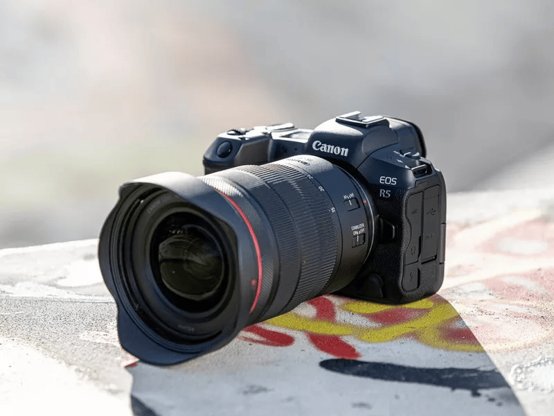

Specifics about the hardware and software equipment I use for work and for my personal life.

The page is part of the [uses.tech](https://uses.tech/) project.

## Photo Setup

### Canon

* [Canon EOS R5](https://www.canon.it/cameras/eos-r5/)
* [Canon RF 50MM F1.8 STM](https://www.canon.it/lenses/rf-50mm-f1-8-stm/)
* [Canon RF 24-105MM F/4L IS USM](https://www.canon.it/lenses/canon-rf-24-105mm-f-4l-is-usm-lens/)
* [Canon RF 70-200MM F2.8 L IS USM](https://www.canon.it/lenses/rf-70-200mm-f2-8l-is-usm-lens/)

### FujiFilm

* [FujiFilm X-T30 II](https://fujifilm-x.com/it-it/products/cameras/x-t30-ii/)
* [FUJINON XF18-55MMF2.8-4 R LM OIS](https://fujifilm-x.com/it-it/products/lenses/xf18-55mmf28-4-r-lm-ois/)

### Gadget Fotografico

* [SanDisk 128GB Extreme PRO](https://documents.westerndigital.com/content/dam/doc-library/en_us/assets/public/sandisk/product/memory-cards/extreme-pro-uhs-ii-sd/data-sheet-extreme-pro-uhs-ii-sd.pdf)

## PC Setup

### Hardware

* [MelGeek MOJO68 Advance](https://www.melgeek.com/products/melgeek-mojo68-plastic-advance-see-through-custom-programmable-mechanical-keyboard)

* [Epomaker Split 65](https://epomaker.com/products/epomaker-split-65?_pos=4&_sid=37b0e8fa3&_ss=r)

* [Blue Yeti Microfone](https://www.amazon.it/gp/product/B01LY6Z2M6)

### Software

* [VS Code](https://code.visualstudio.com/)

#### VS Code Plugins

* [Python](https://marketplace.visualstudio.com/items?itemName=ms-python.python)
* [DevGPT](https://marketplace.visualstudio.com/items?itemName=bogdanaks.devgpt)
* [Remote SSH](https://marketplace.visualstudio.com/items?itemName=ms-vscode-remote.remote-ssh)
* [One Dark Pro](https://marketplace.visualstudio.com/items?itemName=zhuangtongfa.Material-theme)
* [EditorConfig for VS Code](https://marketplace.visualstudio.com/items?itemName=EditorConfig.EditorConfig)
* [.ENV Switcher](https://marketplace.visualstudio.com/items?itemName=EcksDy.env-switcher)
* [PeacockCode](https://www.peacockcode.dev/)

### Fonts

* [MonoLisa](https://www.monolisa.dev/)
* [JetBrains Mono](https://www.jetbrains.com/lp/mono/)
* [Fira Code](https://github.com/tonsky/FiraCode)
* [Operator Mono](https://www.typography.com/fonts/operator/styles)

### Gadget

* [Rubber Duck for Debugging - Dark Soul Oscar Knight of Astora](https://tubbz.com/collections/dark-souls-tubbz/products/dark-souls-oscar-knight-of-astora-tubbz-cosplaying-duck-collectible)
