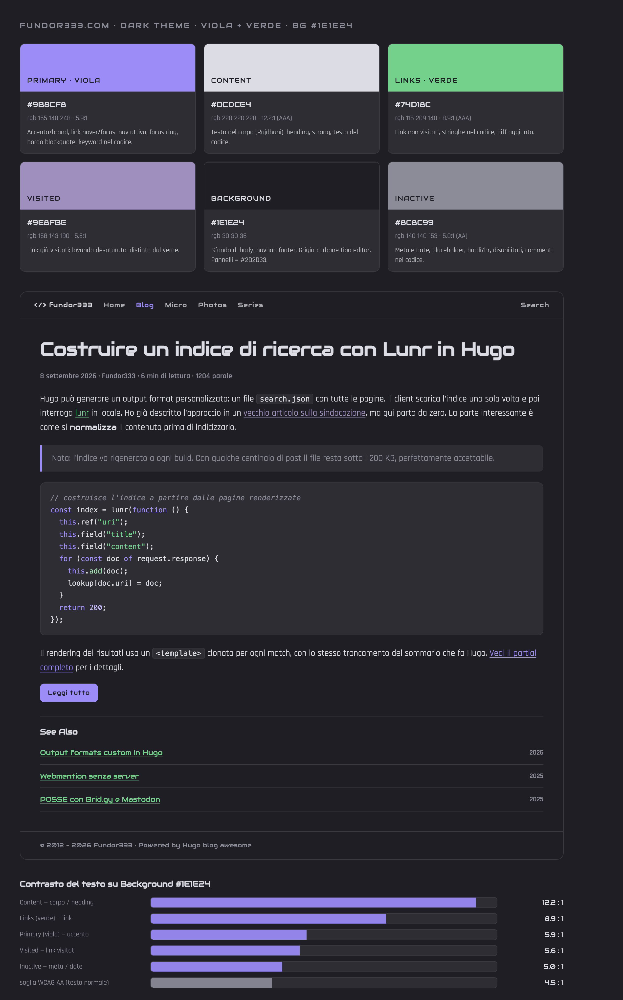

# Struttura e funzionalità del tema

Questo documento descrive **tutte le funzionalità** che compongono il rendering di
`fundor333.com`:

1. cosa fornisce il tema base **`hugo-blog-awesome`** (in `themes/hugo-blog-awesome/`);
2. cosa aggiunge o sovrascrive lo strato locale in **`layouts/`** (che ha priorità
   sul tema);
3. una **checklist finale** — un elenco di funzioni da implementare se si volesse
   riscrivere da zero un tema con le stesse capacità;
4. una **palette di colori per il dark theme** (Parte 4) costruita su 6 ruoli
   semantici e calibrata sui font attualmente in uso.

Lo stack dei temi è dichiarato in `config/_default/hugo.yaml`:

```yaml
theme: ["hugo-redirect", "hugo-blog-awesome"]
```

`hugo-redirect` fornisce solo la generazione di pagine di redirect a partire dagli
`aliases` nel front matter. Tutto il resto del layout arriva da `hugo-blog-awesome`
+ override locali.

> Regola di risoluzione di Hugo: se un file esiste in `layouts/` **e** nel tema,
> vince quello di `layouts/`. Molti file qui sotto sono copie modificate dei file
> del tema.

---

## Parte 1 — Il tema base: `hugo-blog-awesome`

Tema blog minimale, responsive, con dark/light mode. Funzionalità raggruppate per
area.

### 1.1 Struttura dei layout

| File | Ruolo |
|------|-------|
| `layouts/baseof.html` | Scheletro HTML. Definisce `<html>`, `<body data-theme>`, richiama `head`, `scriptsBodyStart`, `header`, il blocco `main`, `footer`, `scriptsBodyEnd`. |
| `layouts/home.html` | Home page. Non usa `baseof`: ridefinisce l'HTML per poter forzare la classe `dark`/`light` sul `<html>` (anti-flash). Mostra bio + ultimi 5 post + link "vedi tutti". |
| `layouts/list.html` | Pagina lista di sezione. Post raggruppati per anno (`GroupByDate "2006"`), ciascuno reso con `postCard`. |
| `layouts/single.html` | Pagina articolo. Titolo, data (`datePublished`, ISO 8601), table of contents, `.Content`, commenti. |
| `layouts/rss.xml` | Feed RSS 2.0 (ripreso dal template embedded di Hugo) con supporto a `exclude_from_rss` e `rssFeedDescription` (`summary`/`full`). |
| `layouts/404.html` | Pagina non trovata. |

### 1.2 `<head>` — `_partials/head.html`

Concentra tutta la parte non visibile:

- **Meta principali** via `_partials/meta/main.html` → `meta/standard.html` + `meta/post.html`:
  - `<title>`, `og:title`, `twitter:title`, `application-name`, `og:site_name`;
  - `description` derivata da front matter → fallback su `site.Params.description`;
  - `og:description`, `twitter:description`, `itemprop=description`;
  - `og:locale`, `language`, `<link rel="alternate" hreflang>` per ogni traduzione;
  - immagine social (`og:image`, `twitter:image`, `twitter:image:src`) da
    `.Params.image` → fallback `site.Params.ogimage`;
  - **JSON-LD `schema.org/Article`** nella sezione `posts` (headline, autore, date);
  - `<link rel="first|last|prev|next">` per la paginazione nelle liste.
- **Open Graph** e **Twitter Card** (partial dedicati `opengraph.html` / `twitter_cards.html`).
- `<link rel="canonical">`.
- `<link rel="alternate" type="application/rss+xml">` + `rel="feed"`.
- **Pipeline CSS**: `resources.Get "sass/main.scss"` → `ExecuteAsTemplate` → `toCSS`
  → `minify` → `fingerprint`. CSS separato per l'highlight del codice
  (`code-highlight.css`).
- **Favicon set completo**: apple-touch-icon, favicon 16/32, `mask-icon`,
  `shortcut icon`, favicon SVG.
- **Web App Manifest** (`_partials/webmanifest.html`) e **browserconfig.xml**
  (`_partials/browserconfig.html`) generati da template.
- `<meta name="theme-color">` e `<meta name="color-scheme" content="light dark">`.
- **KaTeX** condizionale: `_partials/helpers/katex.html` incluso solo se
  `.Params.math` o `.Site.Params.math`.
- **Google Analytics** incluso solo in `hugo.IsProduction` o `site.Params.env == "production"`.
- **Hook di estensione**: se esiste `partials/custom-head.html` viene incluso
  (punto d'aggancio per il sito, sfruttato dallo strato locale).

### 1.3 Header / navigazione — `_partials/header.html`

- Logo che linka alla home (SVG `svgs/home.svg`).
- **Menu responsive** da `.Site.Menus.main`, con supporto a voci figlie
  (`.HasChildren` / `.Children`) e classe `active` su
  `IsMenuCurrent` / `HasMenuCurrent`.
- **Hamburger CSS-only**: checkbox `#menu-trigger` + label, nessun JS.
- **Selettore di lingua**: `<select>` con tutte le `AllTranslations`, visibile solo
  se `.IsTranslated`; cambia pagina con `onchange="location=…"`.
- **Toggle tema chiaro/scuro** (`#mode`) con due icone sole/luna.

### 1.4 Footer — `_partials/footer.html`

- Icone social da `site.Params.socialIcons` via `_partials/socialIcons.html`.
- Copyright con anno corrente (`now.Format "2006"`) e `author.name`.
- Disclaimer i18n (`footer.disclaimer`).
- **Bottone "torna su"** (`#totop`) reso solo se `site.Params.goToTop`.

### 1.5 Componenti riutilizzabili

| Partial | Funzione |
|---------|----------|
| `_partials/bio.html` | Blocco autore in home: avatar responsive (`Fill` 70/140/210 webp, `srcset` 2x/3x, gestione SVG), `author.intro`, `author.description`. |
| `_partials/postCard.html` | Card di anteprima: titolo linkato, data `<time datetime>` ISO, icona "starred" se `.Params.isStarred`. |
| `_partials/toc.html` | `<details>` con `.TableOfContents`. Attivo per pagina (`.Params.toc`) o globale (`site.Params.toc`); stato aperto via `tocOpen`. |
| `_partials/comments.html` | Include Disqus solo se è configurato `services.disqus.shortname`. |
| `_partials/socialIcons.html` | Cicla la lista di social e per ognuno chiama `svgs/svgs.html`. |
| `_partials/svgs/svgs.html` | **Libreria di ~250 icone SVG inline** selezionate per nome (`github`, `mastodon`, `bluesky`, `kofi`, `codeberg`, …). |
| `_partials/svgs/*.svg` | Icone UI: `home`, `menu`, `sun`, `arrowUp`. |

### 1.6 Pipeline JavaScript

- `_partials/scriptsBodyStart.html`: carica `js/theme.js` **prima** del body
  (imposta il tema salvato senza flash). Minify + fingerprint + `integrity` in
  produzione.
- `_partials/scriptsBodyEnd.html`:
  - `js/main.js` sempre;
  - `js/goToTop.js` se `goToTop`;
  - **script personalizzati** da `site.Params.additionalScripts`: risolti,
    concatenati in `custom.js`, minificati e con `integrity` in produzione; in dev
    caricati `async` non minificati. Errore esplicito se un file non esiste.

### 1.7 Internazionalizzazione

- Cartella `i18n/` con **9 lingue** di default: `de-de`, `en-gb`, `en-us`,
  `fr-fr`, `it`, `ja`, `pt-br`, `ru-ru`, `zh-cn`.
- Chiavi: `home.recent_posts`, `home.see_all_posts`, `single.table_of_contents`,
  `footer.go_to_top`, `footer.disclaimer`, `errors.404`, …

### 1.8 Stili (SCSS)

`assets/sass/main.scss` importa moduli: `_base`, `_fonts`, `_layout`, `_navbar`,
`_post`, `_listpage`, `_tableOfContent`, `_code`, `_dark`, `_goToTop`,
`_miscellaneous`, `_custom` (hook utente). Dark mode gestita via `data-theme` +
`prefers-color-scheme`.

### 1.9 Parametri di configurazione riconosciuti

Dal tema (`params.yaml`): `defaultColor` (`dark`/`light`/`auto`), `mainSections`,
`toc`, `tocOpen`, `goToTop`, `additionalScripts`, `dateFormat`,
`rssFeedDescription`, `socialIcons[]`, `author.{avatar,intro,name,description}`,
`math`, `env`, `webmanifest.theme_color`, `services.disqus.shortname`,
`services.rss.limit`, `googleAnalytics`.

---

## Parte 2 — Lo strato locale `layouts/`

Estende il tema in direzione **IndieWeb / POSSE / personal site**. Di seguito le
capacità aggiunte, per area.

### 2.1 Tipi di contenuto e tassonomie

Sezioni gestite con layout dedicati (oltre a `post`):

| Tipo | Layout | Caratteristiche |
|------|--------|-----------------|
| `post` | `single.html` | Articolo completo: autore, data pubblicazione + data modifica (`GitInfo.AuthorDate` vs `PublishDate`), reading time, word count, cover image (`cover.{webp,jpg,png,jpeg}` dalle Resources), `feature_link`/`feature_text`. |
| `micro` | `micro/single.html` | Micropost/status. Header ridotto, semantica di risposta (vedi 2.4). |
| `photos` | `photos/single.html` | Galleria fotografica con **tabella EXIF** per immagine. |
| `weeknote` | `weeknote/single.html` | Nota settimanale, con cover image. |
| `event` | `event/single.html` + `event/list.html` | Eventi con `start`, `end`, `location`; lista raggruppata per anno su `GroupByParam "start"`. |
| `now` | `now/single.html` + `now/list.html` | Pagina "/now": la voce più recente è mostrata inline, le altre come card. Stile `typewriter`. |
| `series` | `series/list.html` + `_partials/series.html` | Raggruppamento di post in serie con navigazione. |

Tassonomie personalizzate (`hugo.yaml`): `series`, `categories`, `tags`,
`themes`, `group`. Override di `taxonomy.html` (elenco alfabetico dei termini con
`postCard`) e `term.html`.

`params.yaml` introduce set di sezioni configurabili:
`mainSections`, `secondarysections`, `feedSections`, `commentSections`,
`suggestionSections` — usati per decidere dove attivare feed, commenti e
"post correlati".

### 2.2 IndieWeb / Microformats2

Tutti i template single marcano il contenuto con microformats2:

- `article.h-entry`, `h1.p-name`, `.u-url`, `.p-summary`, `.p-author.h-card`,
  `time.dt-published`, `.e-content`, `.u-photo` (immagini e cover),
  `.p-category` (tag).
- `_partials/hcard.html` (nel footer): **h-card** completa con
  `p-name`, `u-url`, `u-photo`, **pronomi**
  (`p-pronoun-nominative/oblique/possessive`), `p-nickname`, località
  (`p-locality`/`p-region`/`p-country-name`), da `site.Params.Hcard`.
- `_partials/micro.html`: rende i tipi di risposta IndieWeb dal front matter —
  `Reply` (`u-in-reply-to`), `Repost` (`u-repost-of`), `Like` (`u-like-of`),
  `Bookmark` (`u-bookmark-of`), `Rsvp` (`u-rsvp`),
  `Preview_text_from_reply` (blockquote), `mastodon_reply` (embed toot).

### 2.3 Webmention

- `_partials/webmention.html`: script `webmention.min.js` (webmention.io) che
  popola `#webmentions`, con `data-page-url` normalizzato su `fundor333.com` e
  `data-alternative-url` dagli `aliases`.
- `custom-head.html`: `<link rel="webmention">` e `<link rel="pingback">` verso
  webmention.io.
- Incluso da `_partials/comments.html` per le sezioni in `commentSections`.

### 2.4 Commenti via Mastodon

- `_partials/comments.html`: sezione "Comments" con istruzioni per rispondere via
  Webmention o toot; attiva solo se `.Type` è in `site.Params.commentSections`.
- `_partials/mastodon.html`: se il front matter ha `comments` (host/username/id),
  carica in JS il thread da `https://<host>/api/v1/statuses/<id>/context`,
  sanifica con **DOMPurify** (`purify.min.js`), gestisce emoji custom, avatar,
  badge istanza, marcatura dell'autore originale (`op`).
- `_partials/toot.html` e shortcode `_shortcodes/toot.html`: **embed di uno status
  Mastodon a build time** via `resources.GetRemote` (avatar, contenuto,
  media grid, data). Fallback se la sorgente non è raggiungibile.

### 2.5 Syndication (POSSE)

- `_partials/syndication.html`: blocco "This post was also syndicated to:" dai
  link in `.Params.syndication`, marcati `u-syndication`.
- `_partials/syndication-script.html`: JS che **abbellisce** i link di
  syndication — estrae `dominio/@utente` per Mastodon (lista di istanze note),
  `r/community` per Reddit, `@handle` per Bluesky.
- `_partials/bridgy.html` + `_partials/bridgy/{micro,photos}.html`: markup nascosto
  per **Brid.gy Publish** verso i target in `site.Params.bridgy`
  (`mastodon`, `bluesky`), con `p-bridgy-omit-link`, contenuto per tipo,
  `u-url` con parametri UTM (`utm_source=bridgy…`).
- Configurazione e tooling esterni: `config/syndication.yaml` + CLI Python
  (`syndication_cli/`, documentata in `docs/SYNDICATION.md`) che scrive
  `data/syndication/` e `log_feed.csv`.

### 2.6 Ricerca client-side

- Output format custom `SearchIndex` (`hugo.yaml`) → `layouts/index.searchindex.json`
  genera `/search.json` con `uri`, `title`, `content`, `subtitle`, `date`,
  `description`, `categories`, `tags` per ogni `RegularPages`.
- `layouts/search/list.html` (sezione `/search`): carica `lunr.min.js` e i partial
  di ricerca.
- `_partials/search-form.html`: form GET su `?q=`, pre-popolato dal parametro URL.
- `_partials/search-index.html`: costruisce l'indice **lunr**, esegue la query,
  rende i risultati da un `<template>`, con logica di troncamento del sommario
  equivalente a quella di Hugo.
- `_partials/search-index.html` alternativo nel tema (`index.searchindex.json` è
  già presente): qui è tutto locale.

### 2.7 Feed multipli

Oltre a RSS, `hugo.yaml` dichiara output aggiuntivi:

| Output | Layout | Note |
|--------|--------|------|
| RSS | `layouts/rss.xml` | Aggiunge `<?xml-stylesheet href="/rss.xsl">` e namespace `media`. |
| Atom | `layouts/list.atom.xml` | `feedUUID` come `urn:uuid`, `webfeeds:icon`, `<updated>` con formato `dateFormatAtomFeed`, contenuto in CDATA. Media type custom `application/atom+xml`. |
| JSON Feed | `layouts/list.json.json` | JSON Feed 1.1: item con `content_html`, `content_text`, `tags`, `image`/`banner_image` dalla cover. |
| humans.txt | `layouts/index.humanstxt.txt` | `/humans.txt` con team, sito, componenti. |
| robots.txt | `layouts/robots.txt` | `Disallow` dinamico per pagine con `robotsdisallow: true`. |

Feed attivati per `home` e `section` (`outputs` in `hugo.yaml`). RSS locale
**non** filtra `exclude_from_rss` (differenza rispetto al tema); il limite è
`services.rss.limit: 20`.

### 2.8 Hook di markup (render hooks)

| File | Effetto |
|------|---------|
| `_markup/render-link.html` | Aggiunge `utm_source`/`utm_medium=referral` ai link esterni (se non già presenti), `target="_blank"` sugli `http(s)`, icona link FontAwesome sugli `https`. Classe `interlink-script`. |
| `_markup/render-image.html` | Immagini come `<figure>` (blocco) o `` inline, sempre con `class="center-img u-photo"`, `alt` da testo, `figcaption` da title. |
| `_markup/render-heading.html` | Heading con `id`, anchor `<a href="#…">`, chevron FontAwesome ripetuti per livello. |
| `_markup/render-codeblock.html` | `transform.HighlightCodeBlock` per l'evidenziazione. |

### 2.9 Shortcode aggiunti

| Shortcode | Funzione |
|-----------|----------|
| `toc` | Table of contents "appiattita" (rimuove `<ul><li><ul>` ridondanti). |
| `toot` | Embed di uno status Mastodon (`instance`, `id`) a build time. |
| `xkcd` | Embed di una striscia xkcd via API JSON (`https://xkcd.com/<id>/info.0.json`). |
| `embed` | `<iframe>` generico (url, width%, height). |
| `allpages` | Elenco delle pagine con `allpage: true` nel front matter. |
| `opmlblogroll` / `opmlpodroll` | Blogroll / podroll da API remota (`appletune.fundor333.com`), raggruppati. |
| `88x31` | Rende i badge 88×31 (vedi 2.11). |
| `buzzword` | Segnaposto `<span class="buzzword">`. |
| `heart` | Icona cuore FontAwesome animata. |

### 2.10 Override di header, footer, head

- `_partials/header.html` (locale): logo e hamburger con **FontAwesome** invece
  di SVG del tema; aggiunge una voce di menu **cerca** (`/search`); toggle tema
  con icone FontAwesome.
- `_partials/head.html` (locale): identico al tema ma include **sempre**
  `custom-head.html` (senza il check `templates.Exists`).
- `_partials/custom-head.html`: jQuery, `anchor.js`, **kit FontAwesome**,
  `share-button.js` (module), `add.scss` compilato, `<link rel="alternate">` per
  Atom e JSON feed, verifica dominio Pinterest, `<link rel="author" href="humans.txt">`,
  meta autore + `fediverse:creator`.
- `_partials/footer.html` (locale): sostituisce le icone con `hcard`, aggiunge
  **badge 88×31**, **IndieWeb webring** (xxiivv), **webring-css** (djangowebring),
  copyright `2012 – <anno>`, poi:
  - `codecorner.js` (asset, minify + fingerprint + integrity);
  - **umami analytics** self-hosted (`stats.fundor333.com`, multi-dominio,
    `data-performance`);
  - configurazione `anchor.js` (icona ❡ sui paragrafi di `.e-content`);
  - script jQuery che fissa l'attributo `height` sulle `img.u-photo` (anti-CLS);
  - `ko-fi.html` (attualmente vuoto), `syndication-script.html`,
    `module-html.html` (CDN `share-on-mastodon`).

### 2.11 Badge 88×31

- `_partials/88x31.html`: legge `data/88x31.json` (`badges[]` con `img`/`alt`/`url`),
  scandisce anche `static/icons/88x31/` per immagini locali, unisce le due fonti,
  **mescola** (`shuffle`) l'ordine e rende `` (linkate o meno).
- Esposto anche come shortcode `88x31`.

### 2.12 Post correlati e backlink

- `_partials/comments.html` mostra "See Also" per le sezioni in
  `suggestionSections` usando `.Site.RegularPages.Related` (config `related` in
  `hugo.yaml`: indici su categories/title/description/tags/meta/date con pesi).
- `_partials/inbound-links.html`: calcola i **backlink** cercando con `findRE`
  l'`href` della pagina corrente nel `.Content` degli altri post.

### 2.13 Citazione, condivisione, "scritto da umano"

- `_partials/cite.html`: `<details>` "Reference this post" con campo di sola
  lettura contenente il permalink e bottone **copia negli appunti**.
- `_partials/share-buttons.html`: web component `<share-on-mastodon>`.
- `single.html` inserisce `<p class="written-by-human">Written by a human</p>`
  in coda al contenuto.

### 2.14 Analytics ed eventi

- **umami** self-hosted nel footer.
- `_partials/socialIcons.html` (locale) aggiunge `data-umami-event` sui click
  social.
- `_partials/tags.html`: rende tag / categorie / themes / group come
  `#link .p-category.tag`, ciascuno con `data-umami-event` dedicato.
- Google Analytics resta disponibile via l'hook del tema (non configurato).

### 2.15 Home page locale

`layouts/home.html`: come il tema ma mostra **20** post invece di 5, forza
`data-theme="dark"` sul `<html>`, e aggiunge una seconda lista
**"Recent Updates"** dalle `secondarysections`.

### 2.16 Galleria foto ed EXIF

`layouts/photos/single.html`: per ogni immagine delle Resources costruisce
`<figure class="hmedia">` + tabella dei metadati. Preferisce un
`exif.json` accanto alle immagini (chiavi: `datetimeoriginal`, `model`,
`lensmodel`, `shutter_speed`, `aperture`, `iso`, `focal_length`,
`exposure_mode/program/bias`, `white_balance`, `metering_mode`); in mancanza usa
l'EXIF nativo di Hugo (`.Exif.Tags`) con mappatura dei valori numerici in
etichette leggibili.

### 2.17 Archetypes e asset locali

- `archetypes/`: `post.md`, `micro.md`, `now.md`, `photos.md`, `page.md`.
- `assets/sass/` locali: `add.scss` (+ `_imports`, `root`, `author`, `menu`,
  `link`, `media`, `comments`, `mastodon`, `webmention`, `interaction`,
  `materials`, `typewriter`, `pride`, `weeknote`, `xkcd`, `88x31`,
  `reduced-motion`, `share-button`, `input`).
- `static/js/` locali: `lunr`, `purify` (DOMPurify), `webmention`, `share-button`,
  `search`, `jquery`.
- `data/` come sorgente di contenuto: `88x31.json`, `about.json`, `books.json`,
  `jobs.json`, `project.json`, `blogroll.xml`, `note.json`, `packages.yaml`,
  `github/`, `event/`, `syndication/`, `webmentions/`.

---

## Parte 3 — Checklist: funzioni per costruire un tema equivalente

Elenco operativo delle capacità da implementare, con il file/meccanismo Hugo
corrispondente.

### Fondamenta

- [ ] `baseof.html` con blocco `main` e partial `head`/`header`/`footer`.
- [ ] Home page dedicata che forza la classe tema sul `<html>` (anti-flash).
- [ ] `list.html` con raggruppamento per anno (`GroupByDate`).
- [ ] `single.html` con titolo, date (pubblicazione + modifica), `.Content`.
- [ ] `404.html`.
- [ ] `taxonomy.html` + `term.html`.

### `<head>` e SEO

- [ ] Meta standard + `description` con fallback di sito.
- [ ] Open Graph + Twitter Card.
- [ ] JSON-LD `schema.org/Article`.
- [ ] `canonical`, `hreflang` per traduzioni, `rel=alternate` per ogni feed.
- [ ] `rel="first/last/prev/next"` nelle liste paginate.
- [ ] Favicon set completo + Web App Manifest + browserconfig + `theme-color`.
- [ ] Hook `custom-head.html` per estensioni di sito.

### Asset pipeline

- [ ] SCSS → `toCSS` → `minify` → `fingerprint`; CSS highlight separato.
- [ ] JS `theme.js` in testa (anti-flash), `main.js` + opzionali in coda.
- [ ] Concatenazione/minify/`integrity` degli script custom in produzione.
- [ ] `additionalScripts` configurabile con errore se mancano file.

### Navigazione e UI

- [ ] Menu da `Site.Menus.main` con sottovoci e stato `active`.
- [ ] Hamburger CSS-only.
- [ ] Selettore lingua da `AllTranslations`.
- [ ] Toggle dark/light + persistenza (JS) + `data-theme` / `prefers-color-scheme`.
- [ ] Bottone "torna su" opzionale.
- [ ] `postCard` riutilizzabile con `<time datetime>` e marcatori speciali
      (starred, speaker, icona per tipo).
- [ ] Blocco bio/h-card con avatar responsive (`Fill`, `srcset`, SVG).

### i18n

- [ ] Cartella `i18n/` multilingua; stringhe UI via `T`/`i18n`.

### Feed e output alternativi

- [ ] RSS con `exclude_from_rss` e sommario/full configurabile + `xml-stylesheet`.
- [ ] Atom (output format custom, `feedUUID`, `webfeeds`).
- [ ] JSON Feed 1.1.
- [ ] `humans.txt`.
- [ ] `robots.txt` con `Disallow` dinamico da front matter.
- [ ] Indice di ricerca JSON (output format custom).

### Ricerca client-side

- [ ] Sezione `/search`, form GET `?q=`, indice **lunr**, rendering da
      `<template>`, troncamento sommario.

### Tipi di contenuto (IndieWeb / personal site)

- [ ] Layout per `micro`, `photos`, `weeknote`, `event`, `now`, `series`.
- [ ] Tassonomie custom (`series`, `themes`, `group`, …).
- [ ] Set di sezioni configurabili: `main`, `secondary`, `feed`, `comment`,
      `suggestion`.

### Microformats2 / IndieWeb

- [ ] `h-entry` / `h-card` / `e-content` / `u-photo` / `p-category` / `dt-published`.
- [ ] h-card con pronomi, nickname, località.
- [ ] Tipi di risposta: reply / repost / like / bookmark / rsvp.
- [ ] Invio e visualizzazione **Webmention** (`rel=webmention`, script di rendering).
- [ ] Markup **Brid.gy Publish** con target configurabili e parametri UTM.

### Social / syndication

- [ ] Blocco "syndicated to" + abbellimento link (Mastodon/Reddit/Bluesky).
- [ ] Commenti da thread Mastodon (fetch API + DOMPurify).
- [ ] Embed status Mastodon a build time (`resources.GetRemote`).
- [ ] Web component di condivisione.
- [ ] (Opzionale) CLI esterna per raccogliere i link di syndication.

### Render hooks

- [ ] Link: UTM sugli esterni, `target=_blank`, icona.
- [ ] Immagini: `<figure>` + classi microformat.
- [ ] Heading: anchor con `id` e link.
- [ ] Codeblock: highlight.

### Shortcode utili

- [ ] `toc` appiattita, `embed` iframe, `toot`, `xkcd`, blogroll/podroll da OPML,
      badge 88×31, elenco pagine, segnaposti stilistici.

### Extra "small web"

- [ ] Badge 88×31 da cartella + JSON, con shuffle.
- [ ] Webring(s).
- [ ] Blocco "cita questo post" con copia negli appunti.
- [ ] Marcatore "scritto da umano".
- [ ] Post correlati (`Related`) + backlink (`findRE` sul contenuto).

### Analytics

- [ ] Provider configurabile (GA condizionale a `production`).
- [ ] Analytics self-hosted (umami) + `data-*-event` su link social e tag.

### Galleria foto

- [ ] Gallery da Page Resources con tabella EXIF (`exif.json` o `.Exif` nativo),
      valori numerici mappati in etichette.

### Palette / theming

- [ ] Palette dark a 6 ruoli semantici (Parte 4), mappata sui custom properties
      di `assets/sass/root.scss` e sugli elementi del tema.
- [ ] Superfici e bordi derivati per opacità dai 6 colori (nessuna tinta extra).

---

## Parte 4 — Palette colori: dark theme

Palette **solo scura** basata su **6 ruoli semantici**, pensata per un blog di
sviluppo/codice: molta prosa, blocchi di codice, snippet inline, tabelle, link
frequenti. Due sole tinte d'accento: **un viola** (*Primary*) e **un verde**
(*Links*). Nel *chrome* del sito non entra nessun altro colore: ogni sfondo,
bordo o stato si ottiene per **opacità** a partire da questi sei valori. È
calibrata sui font realmente in uso (`assets/sass/root.scss`):

- **Rajdhani** 400 — testo del corpo (`html body`): condensato e a stroke
  leggero → serve un *Content* molto chiaro;
- **Audiowide** — heading, link (`html a`), `strong`, `.footer_copyright`:
  display largo con aste sottili a misura piccola → serve un *Links* verde
  luminoso per restare leggibile inline;
- **Ocean Trace** — firma `.written-by-human` (usa *Content* con `opacity: .8`,
  già previsto → nessun colore dedicato).

> Ricalcolo su **Background `#1E1E24`** (più chiaro del blu-nero precedente:
> luminanza relativa ≈ 0.0133, circa il doppio). Viola e verde sono stati
> schiariti per mantenere il contrasto ≥ AA; *Inactive* è stato alzato di
> conseguenza.

### 4.1 Ruoli e valori

| Ruolo | Token | Hex | RGB | Uso |
|-------|-------|-----|-----|-----|
| **Primary** *(viola)* | `--c-primary` | `#9B8CF8` | `155 140 248` | Accento/brand: `--accent-color`, link `:hover`/`:focus`/`:active`, nav voce attiva, focus ring, hover del bottone "torna su", bordo `<blockquote>`, keyword nel codice. |
| **Content** | `--c-content` | `#DCDCE4` | `220 220 228` | Testo del corpo (Rajdhani), heading, `strong`, testo del codice. Grigio-bianco con lieve tinta viola per legare al fondo; non `#fff` → meno halazione con Rajdhani. |
| **Links** *(verde)* | `--c-link` | `#74D18C` | `116 209 140` | Link non visitati (`html a`, in Audiowide). Verde menta/salvia, chiaro e nettamente distinto dal viola; stringhe e diff aggiunta nel codice. |
| **Visited** | `--c-visited` | `#9E8FBE` | `158 143 190` | Link visitati (`a:visited`). Lavanda desaturato: "parente" di *Primary* ma più spento → "già letto"; lontanissimo dal verde. |
| **Background** | `--c-background` | `#1E1E24` | `30 30 36` | Sfondo di `body`, navbar, footer. Grigio-carbone con lieve tinta viola ("eigengrau"), tipo editor: comodo per sessioni lunghe di lettura codice. |
| **Inactive** | `--c-inactive` | `#8C8C99` | `140 140 153` | Meta (data, autore), `.post-meta`, `.post-item-meta`, `.footer_copyright`, placeholder di ricerca, bordi/`<hr>`/separatori, stati disabilitati, `--neutral`, commenti nel codice. |

Superficie derivata usata di frequente:
`--c-surface = color-mix(in srgb, var(--c-content) 8%, var(--c-background))`
≈ `#2D2D33` — pannello leggermente in rilievo per `code`, `pre`, `.toc`,
`<blockquote>`, riga pari di tabella. Bordo standard
`color-mix(var(--c-content) 14%, var(--c-background))` ≈ `#39393F`.

### 4.2 Verifica di leggibilità (WCAG 2.1, testo su `#1E1E24`)

| Coppia | Rapporto | Esito |
|--------|----------|-------|
| Content `#DCDCE4` su Background | **12.2 : 1** | AAA (corpo e heading) |
| Links `#74D18C` su Background | **8.9 : 1** | AAA |
| Visited `#9E8FBE` su Background | **5.6 : 1** | AA (anche testo piccolo) |
| Primary `#9B8CF8` su Background | **5.9 : 1** | AA (testo), AAA per elementi UI |
| Inactive `#8C8C99` su Background | **5.0 : 1** | AA (meta e testo secondario) |
| Background `#1E1E24` su Primary (etichetta bottone) | **5.9 : 1** | AA |
| Content su `--c-surface` `#2D2D33` | **10.1 : 1** | AAA (codice) |
| Links (verde) vs Primary (viola) | hue opposti | link e accento mai confondibili |
| Visited (lavanda) vs Links (verde) | hue opposti | stato visitato sempre distinguibile |
| Visited (lavanda) vs Primary (viola) | Visited più spento e chiaro | distinguibili nei rari accostamenti |

Tutte le combinazioni di testo passano **AA**; corpo, heading e codice passano
**AAA**. Il valore più basso resta *Inactive* (5.0:1), comunque sopra la soglia
4.5:1: anche le date dei post restano leggibili.

### 4.3 Superfici e bordi senza colori extra

Tutto ciò che non è testo è una miscela di *Content* o *Primary* **su
*Background*** (opaca, non trasparente, così i pannelli sono prevedibili):

| Elemento | Derivazione |
|----------|-------------|
| `code`/`pre`/`.toc`/`<blockquote>`/riga pari tabella | `--c-surface` (*Content* @ 8% su *Background*, ≈ `#2D2D33`) |
| Bordo, `<hr>`, separatore `.post-item`, bordo navbar/tabella | *Content* @ 14% su *Background* (≈ `#39393F`) |
| `#totop` sfondo / hover | *Content* @ 10% su *Background* / *Primary* |
| Focus outline | *Primary* @ 55% |
| Sottolineatura link | *Links* @ 45% |
| Bordo `<blockquote>` / testo `<blockquote>` | *Primary* / *Inactive* |

### 4.4 Evidenziazione della sintassi (Chroma)

Solo **viola + verde** (più due tint) per i token; il blocco di codice è un
componente **contenuto**:

| Token Chroma | Colore | Origine |
|--------------|--------|---------|
| testo, punteggiatura (`.p`) | `#DCDCE4` | *Content* |
| commento (`.c`, `.cm`) — *italic* | `#8C8C99` | *Inactive* |
| keyword / operatore (`.k`, `.o`) | `#9B8CF8` | *Primary* (viola) |
| stringa (`.s`) | `#74D18C` | *Links* (verde) |
| funzione / classe (`.nf`, `.nc`) | `#A6E0B4` | tint chiaro di *Links* |
| numero / costante / bool (`.m`, `.kc`) | `#C3B8F5` | tint chiaro di *Primary* |
| diff aggiunta (`.gi`) | `#74D18C` | *Links* |
| errore / diff rimossa (`.err`, `.gd`) | `#E1808F` | rosso — **unica utility opzionale**, solo dentro `<pre>` |
| sfondo del blocco | `#2D2D33` | `--c-surface` |

Versione **stretta**: niente rosso → errori/diff-rimossa = *Primary*. Numeri e
funzioni restano tint di viola/verde, quindi la scala completa non esce mai dalle
due tinte d'accento.

### 4.5 Snippet pronto — `assets/sass/add.scss`

```scss
/* Dark theme palette — 6 ruoli semantici: 1 viola + 1 verde + 4 neutri */
:root {
  --c-primary:    #9B8CF8; /* Primary  — viola */
  --c-content:    #DCDCE4; /* Content         */
  --c-background: #1E1E24; /* Background      */
  --c-link:       #74D18C; /* Links    — verde */
  --c-visited:    #9E8FBE; /* Visited  — lavanda */
  --c-inactive:   #8C8C99; /* Inactive        */
  --c-surface:    color-mix(in srgb, #DCDCE4 8%, #1E1E24); /* pannello ~#2D2D33 */
}

@mixin palette-dark {
  // --- custom properties di root.scss ---
  --accent-color:               var(--c-primary);
  --accent-color-text:          var(--c-background);
  --neutral:                    var(--c-inactive);
  --code-text-color:            var(--c-content);
  --code-background-color:       var(--c-surface);
  --pre-background-color:        var(--c-surface);
  --pre-text-color:             var(--c-content);
  --table-border-color:         color-mix(in srgb, var(--c-content) 14%, var(--c-background));
  --tr-even-background-color:    var(--c-surface);
  --blockquote-background-color: var(--c-surface);

  // --- elementi ---
  body                         { color: var(--c-content); background-color: var(--c-background); }
  h1, h2, h3, h4, h5, h6,
  strong, b                    { color: var(--c-content); }
  .post-meta, time,
  .post-item-meta,
  .footer_copyright            { color: var(--c-inactive); }

  a                            { color: var(--c-link);
                                 text-decoration-color: color-mix(in srgb, var(--c-link) 45%, transparent); }
  a:visited                    { color: var(--c-visited); }
  a:hover, a:focus, a:active   { color: var(--c-primary); }
  a:focus-visible              { outline: 2px solid color-mix(in srgb, var(--c-primary) 55%, transparent); }

  blockquote                   { border-color: var(--c-primary); color: var(--c-inactive); }
  hr, .navbar,
  .post-item:not(:first-child) { border-color: color-mix(in srgb, var(--c-content) 14%, var(--c-background)); }
  .toc                         { background-color: var(--c-surface); }
  #totop                       { color: var(--c-content);
                                 background-color: color-mix(in srgb, var(--c-content) 10%, var(--c-background)); }
  #totop:hover                 { background-color: var(--c-primary); color: var(--c-background); }
}

// Applicata sia come override del toggle manuale, sia come fallback OS
html.dark { @include palette-dark; }
@media (prefers-color-scheme: dark) { html:not(.light) { @include palette-dark; } }
```

### 4.6 Anteprima



Mockup di riferimento in `docs/palette-preview.png`, generato da
`docs/palette-preview.html` (font reali Audiowide/Rajdhani via Google Fonts):
mostra le sei tessere colore con i codici, un articolo di esempio con heading in
Audiowide, corpo in Rajdhani, link/visited, `<blockquote>`, un blocco di codice
evidenziato (viola + verde) e le barre di contrasto WCAG.

Per rigenerarlo:

```bash
"/Applications/Google Chrome.app/Contents/MacOS/Google Chrome" --headless \
  --force-device-scale-factor=2 --window-size=1260,2450 \
  --default-background-color=1E1E24FF \
  --screenshot=docs/palette-preview.png "file://$PWD/docs/palette-preview.html"
```

### 4.7 Note di integrazione

- Le regole in `add.scss` vincono per **ordine di caricamento e specificità** sui
  valori di default del tema; le variabili SCSS `$dark-*` compilate dentro
  `themes/hugo-blog-awesome/assets/sass/_dark.scss` non sono raggiungibili da qui:
  per allinearle del tutto vanno sovrascritte nell'hook `_custom.scss` del tema,
  altrimenti bastano le regole CSS più specifiche qui sopra.
- `color-mix()` è supportato dai browser moderni; se serve compatibilità più
  ampia, pre-calcolare le miscele (`--c-surface` ≈ `#2D2D33`, bordo ≈ `#39393F`).
- Nel *chrome* del sito entrano solo questi 6 valori (più il pannello derivato) e
  due sole tinte d'accento, **un viola e un verde**. L'unica eccezione è il rosso
  `#E1808F` per gli errori, confinato al `<pre>` e disattivabile (versione
  stretta).
